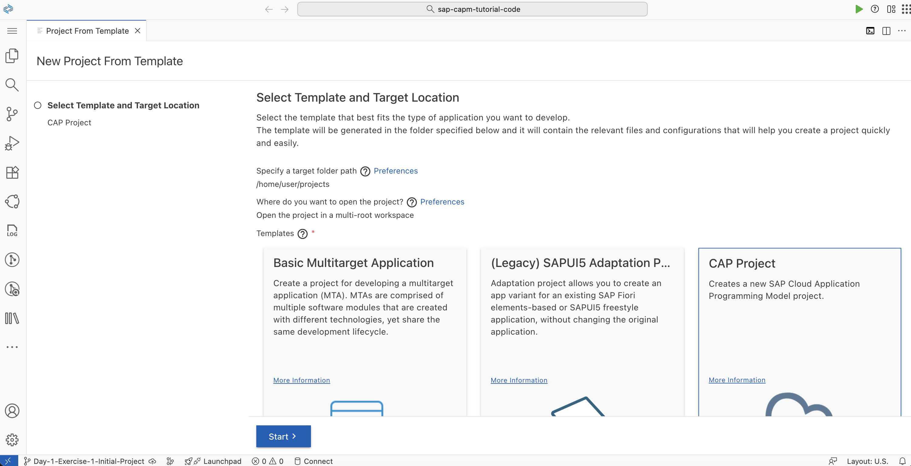
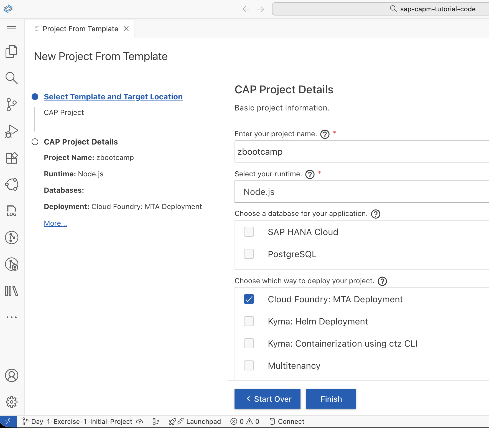
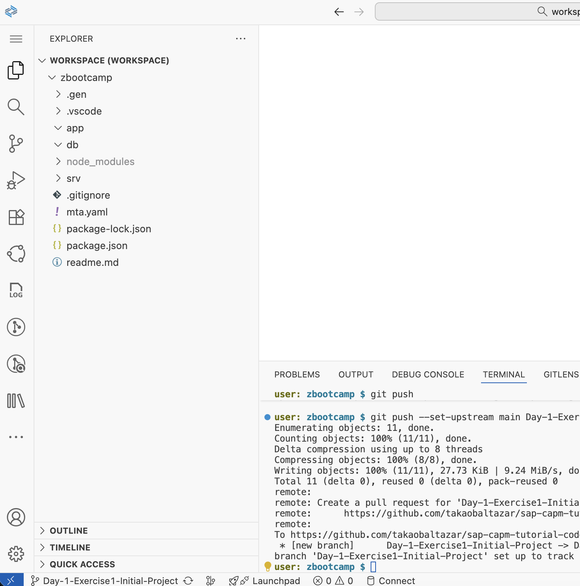
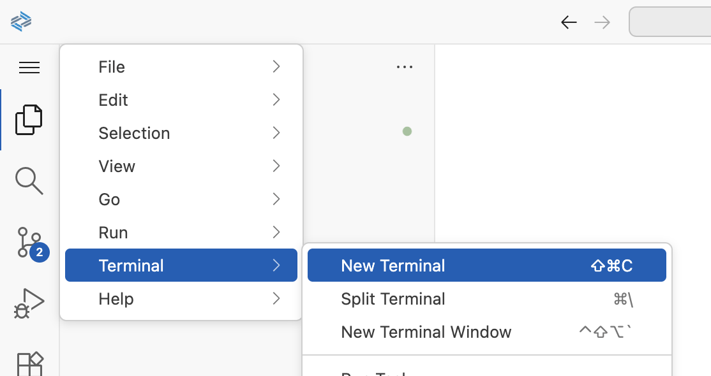
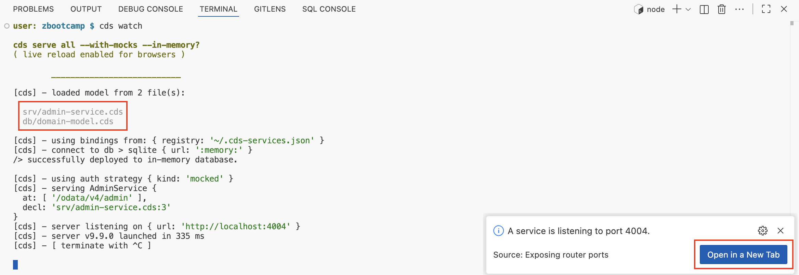
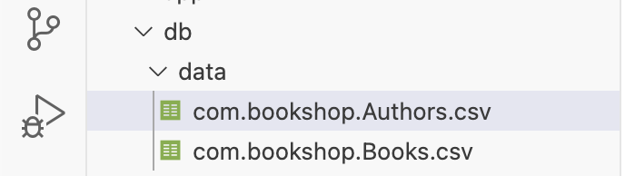
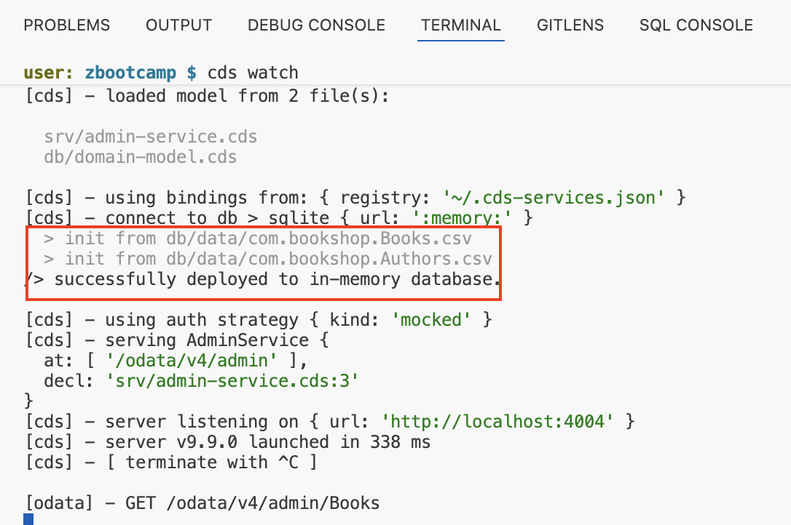

# Day 1 Exercise 1 - Getting Started with CDS
This is a reference of Code for Day 1 Exercise.

## Create initial project via Wizard
### Steps:
1. Open your **Business Application Studio (BAS)** in **SAP BTP**.            
2. Click **Menu** > **File** > **New Project from Template** and select **CAP Project**.
<kbd>  </kbd>

3. Fill-up CAP Project Details:
    - Project Name: **zbootcamp**
    - Runtime: **Node.js**
    - Include feature: **Cloud Foundry: MTA Deployment**
<kbd>  </kbd>

4. Click **Finish.**    

## Preview of Initial Project Workspace
<kbd>  </kbd>

## Define Data Model
### Steps:
1. Right click the `db` folder and create file with `domain-model.cds`.
2. Copy the following code below: 
    ```cds
    namespace com.bookshop;

    entity Books {
        key ID  : String;
        title   : String(100);
        stock   : Integer;
        price   : Decimal(9,2);
    }

    entity Authors {
        key ID  : String;
        name    : String(100);
    }
    ```

## Define Services
### Steps:
1. Right click the `srv` folder and create file with `admin-service.cds`.
2. Copy the following code below.
    ```cds
    using { com.bookshop as bookshop } from '../db/domain-model';

    service AdminService {
        entity Books as SELECT from bookshop.Books;
        entity Authors as SELECT from bookshop.Authors;
    }      
    ```

## Run Service
Using **cds watch** to run the service.
### Steps:
1. Open **terminal** by clicking the **Menu (Burger Icon)** > **Terminal** > **New Terminal**.
<kbd>  </kbd>
                     
2. Run your project using below command
    ```cds
    cds watch
    ```                 
    <kbd>  </kbd>

3. Click **Open in a New Tab** button to view the service. It will open a new browser tab to display list of service endpoints.<br>   


## Add Initial Data to Database
Create **data** folder under **db** root folder, to add Initial data. Use below file name format.   
<kbd> </kbd><br>   

### Steps:
1. **db/data/com.bookshop.Authors.csv**:
```csv
ID,name
b1e548ae-1c30-4f72-ae2b-1ef1e7e53b0b,Scott Fitzgerald
1492c1d5-7443-4469-afd3-02ce078e2c57,Ralph Ellison
3983e0c1-a1f3-45a2-9471-5e262825992b,Virginia Woolf
ba7038a0-3d94-471d-aa33-b7f1e62b9716,Miguel de Cervantes
45f90742-5d58-4423-a68c-50ce26b587ce,Ernest Hemingway
```

2. **db/data/com.bookshop.Books.csv**:
```csv
ID,title,stock,price
78798e35-25a2-4680-be07-27d1cc8abc43,The Great Gatsby,10,500
cf40f587-e367-4f8b-b89a-26deb4c7c81f,Invisible Man,50,400
4d0f58c2-f8f2-4011-83d7-7dbe256b43c6,To the Lighthouse,5,385
99fcaa42-4792-4a36-83bb-8fad02d15d0c,Don Quixote,2,600
113f4d77-8a6a-43ea-b8cd-2c706d5228d5,The Sun Also Rises,100,300
```

## Service running with Data
1. After you add initial data, your **cds watch** in terminal should restart to reflect the changes made in your file. 
    > In case you closed it, open again **terminal** and execute the **cds watch** command.
2. Data are now loaded into the database.
<kbd>  </kbd>

3. Query / Access the service using path /admin.
    - admin/Authors
    - admin/Books    
<kbd>   </kbd>