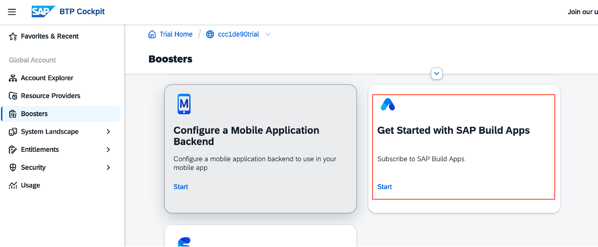
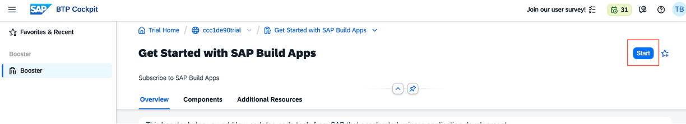
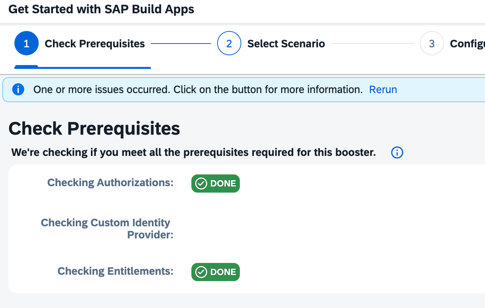
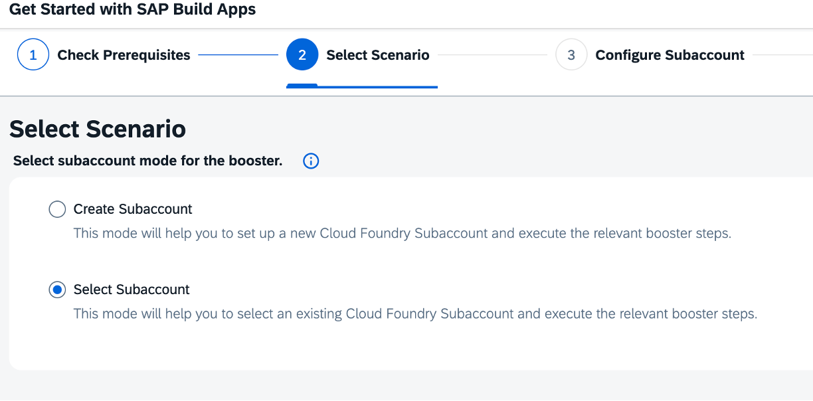
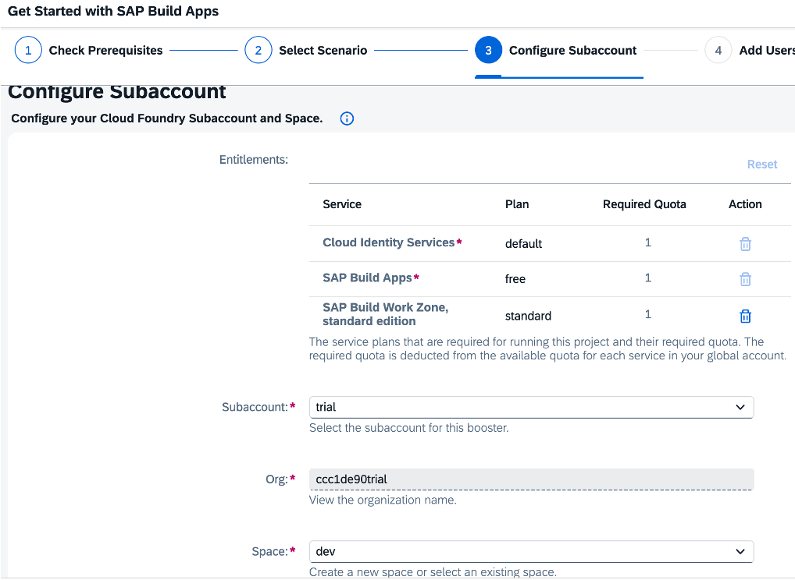
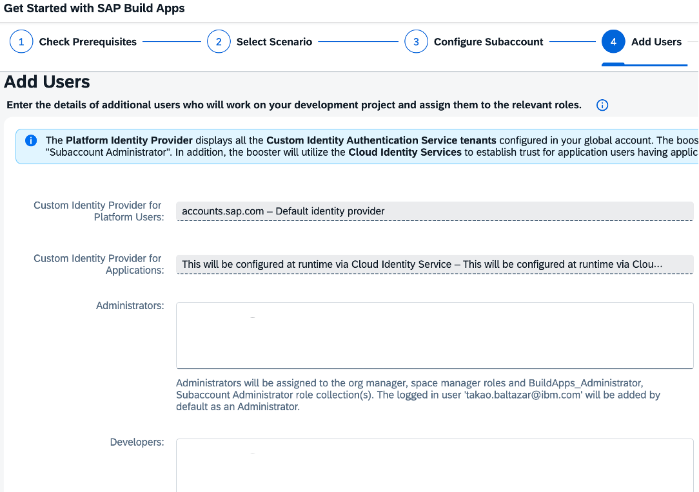
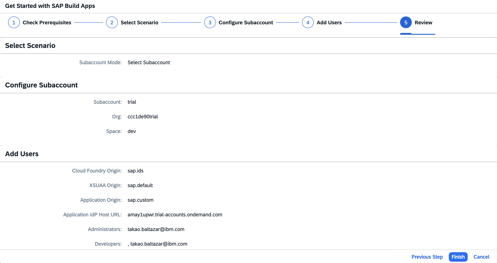

# Day 1 Exercise 2 - Setup Booster
This is a reference of Code for Day 1 Exercise 2.

## Create initial project via Wizard
### Steps:
1. Open your `BTP Cockpit` and navigate to `Global Account (e.g. cccc1e09trial)`.
2. Then go to `Booster` and search for `Get Started with SAP Build Apps` and click it. 
<kbd>  </kbd>

3. Click `Start`. It automatically establishes the necessary trust without requiring access to the Security → Trust Configuration.
<kbd>  </kbd>

4. Click `Next`.
<kbd>  </kbd>

5. Select `Subaccount` and click `Next`.
<kbd>  </kbd>

6. These are the Services will be created and Click `Next`.
<kbd>  </kbd>

7. Click `Next`.
<kbd>  </kbd>

8. Click `Finish`.
<kbd>  </kbd>

## De-activate Custom IDP
### Steps

1. Go to your subaccount system thru `trial` > `Security` > `Trust Configuration`.
<kbd>  </kbd>

2. Select `Default identity Provider` and click `Edit`.
<kbd>  </kbd>

3. In the `Parameters` tab, select `Available for User Logon` and click `Save`.
<kbd>  </kbd>

4. Now, from the `Trust Configuration` menu, click the `Custom IAS tenant` and click `Edit`.
<kbd>  </kbd>

5. In the `Main Information` tab, set the `Status` to **Inactive** and click `Save`.
<kbd>  </kbd>

6. Now, this is the final result after modifying the trust configuration.
<kbd>  </kbd>

## Assign Role Collection
### Steps

1. In your BTP Cockpit, go to `Security` > `Users` and click the user with `Default Identity provider`.
<kbd>  </kbd>

2. Click the button `Assign Role Collection`.
<kbd>  </kbd>

3. Search for `Launchpad_Admin` and click `Assign Role Collection`.
<kbd>  </kbd>