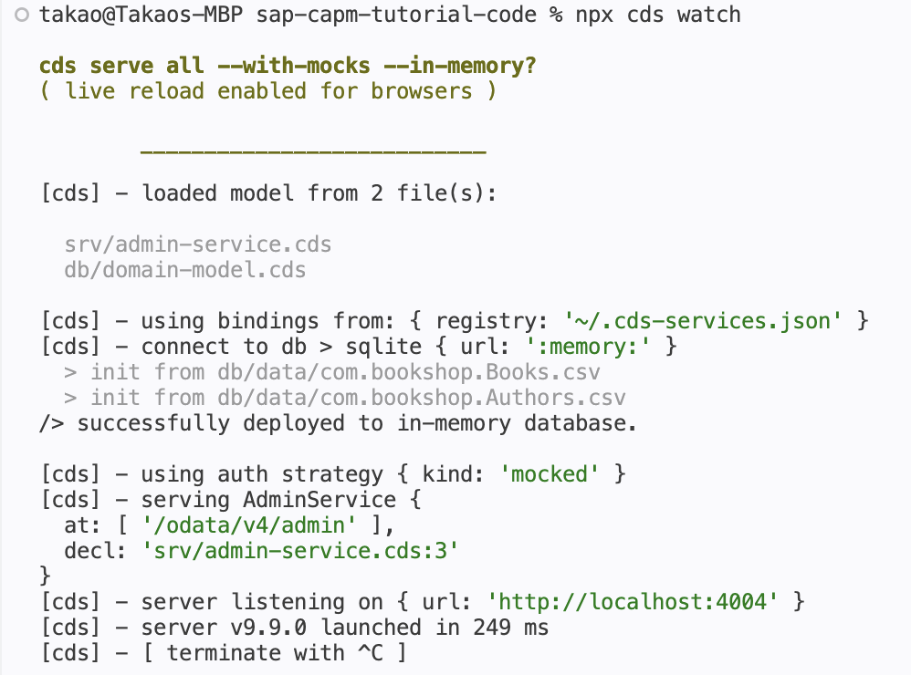
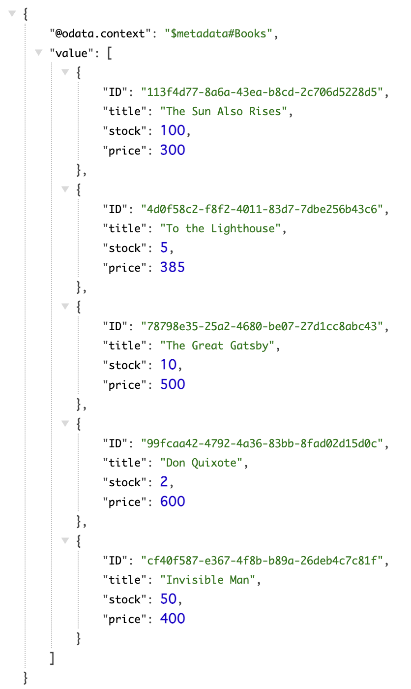

# Day 2 Exercise 1 - Use of Projection
This is a reference of Code for Day 2 Exercise 1.

## Use Projection in Service Definition
### Steps
1. Open **srv/admin-service.cds**
2. Replace `SELECT from` to `projection on`.

```cds
using {com.bookshop as bookshop} from '../db/domain-model';

service AdminService {
    entity Books   as projection on bookshop.Books;
    entity Authors as projection on bookshop.Authors;
}
```

## Run Service
### Steps
1. Open **terminal**.
2. Run app using `cds watch`.
<kbd>  </kbd>

3. Query / Access the service using path **/admin**.
    - admin/Authors                              
    - admin/Books                       
<kbd>  </kbd>