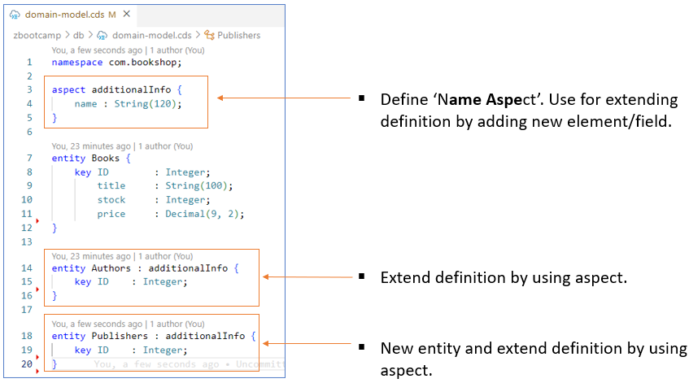
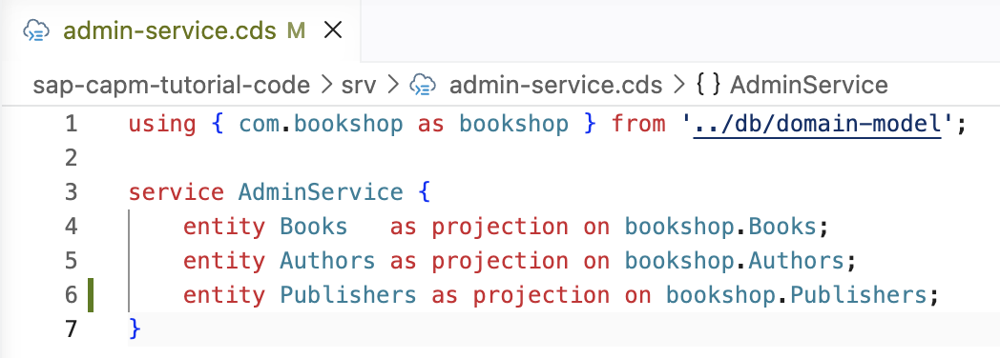
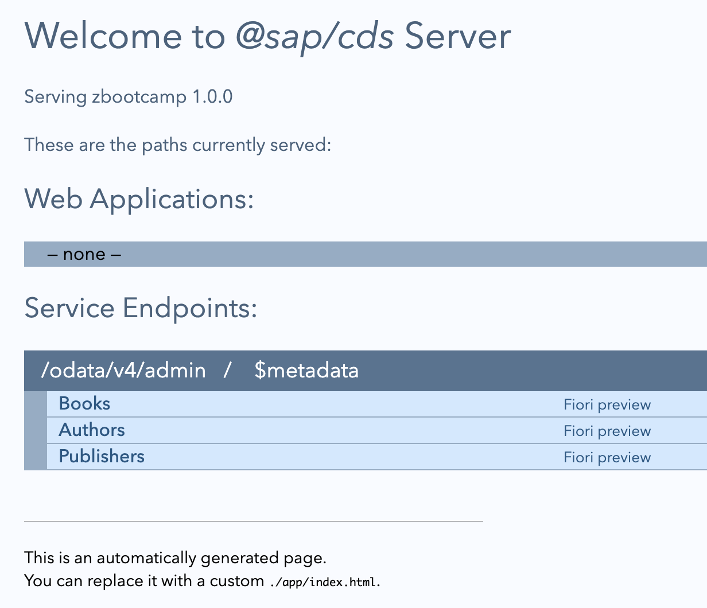
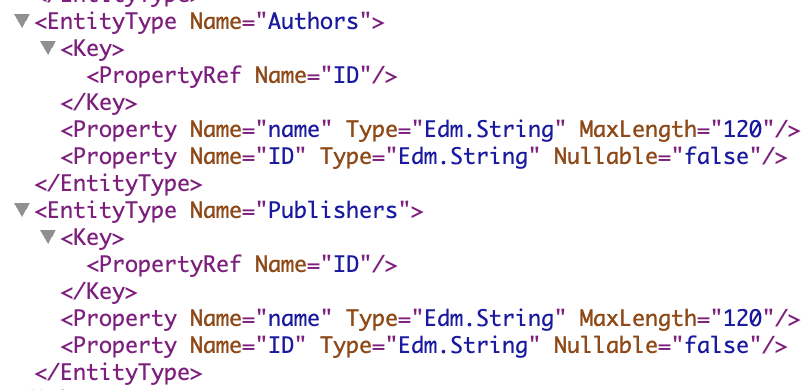
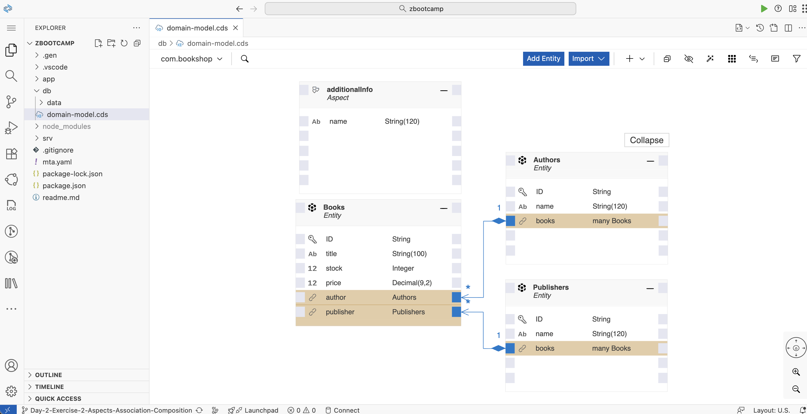
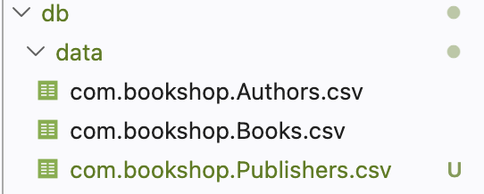
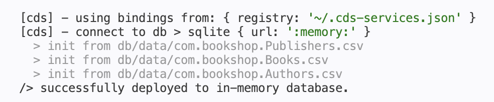
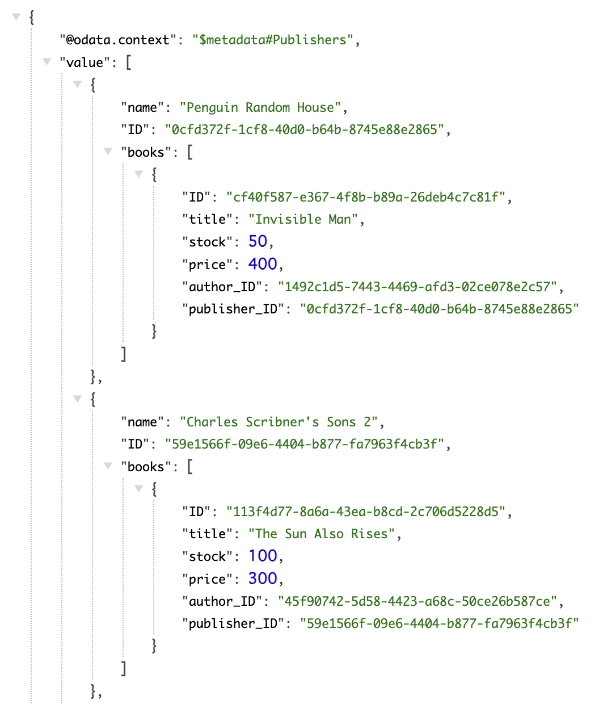

# Day 2 Exercise 2 - Aspect, Association and Composition
This is a reference of Code for Day 2 Exercise 2

## Define Aspect and New Entity
### Steps:
1. Open `db/domain-model.cds` file.
2. Create **name aspect** as **additionalInfo** and assigned it to entity.
3. Remove the **name** field in **Authors** entity.
4. Create new entity **Publishers.**
```cds
namespace com.bookshop;

aspect additionalInfo {
    name: String (120);
}

entity Books {
    key ID  : String;
    title   : String(100);
    stock   : Integer;
    price   : Decimal(9,2);
}

entity Authors: additionalInfo {
    key ID  : String;
}

entity Publishers: additionalInfo {
    key ID  : String;
}
```
<kbd>   </kbd>

## Add new Entity in Service Definition
### Steps:
1. Open `srv/admin-service.cds`
2. Include **Publisher** entity to Service Definition to expose the service.
```cds
entity Publishers as projection on bookshop.Publishers;
```
<kbd>  </kbd>

## Access and Check Metadata
### Steps:
1. Open **terminal** and run `cds watch`.
2. Access the service and click the **/admin/$metadata**
    <kbd> </kbd> <br>   
    <kbd>  </kbd>


## Add Association and Composition
### Steps:
1. Open `db/domain-model.cds`
2. Include relationship for each entity.
```cds
namespace com.bookshop;

aspect additionalInfo {
    name : String(120);
}

entity Books {
    key ID        : String;
        title     : String(100);
        stock     : Integer;
        price     : Decimal(9, 2);
        author    : Association to Authors;
        publisher : Association to Publishers;
}

entity Authors : additionalInfo {
    key ID    : String;
        books : Composition of many Books
                    on books.author = $self;
}

entity Publishers : additionalInfo {
    key ID    : String;
        books : Composition of many Books
                    on books.publisher = $self;
}
```

## CDS Graphical Modeler
You can define entity using **CDS Graphical Modeler**.
It can be access by right click of **Model Definition** > **Opens With** > **CDS Graphical Modeler**.
<kbd>  </kbd>

## Add Initial Data to Publisher entity and Modify Data for Books entity.
Add initial data by creating file under **db/data**.   
<kbd>  </kbd>

### Steps:
1. **db/data/com.bookshop.Publishers.csv:**
```csv
ID;name
993e6c03-be0e-4306-aca4-f45696a375d9;Charles Scribner's Son
0cfd372f-1cf8-40d0-b64b-8745e88e2865;Penguin Random House
9f51d203-bd47-4385-a117-030948ab0ab8;The Hogarth Press
985f807b-6b70-4c58-b711-5320ebe28347;Blas de Robles
59e1566f-09e6-4404-b877-fa7963f4cb3f;Charles Scribner's Sons 2
```

2. **db/data/com.bookshop.Books.csv:**
    - Modify data for Books entity. Include reference to **Publisher entity** by including **author_ID** and **publisher_ID**.<br>
```csv
ID,title,stock,price,author_ID,publisher_ID
78798e35-25a2-4680-be07-27d1cc8abc43,The Great Gatsby,10,500,b1e548ae-1c30-4f72-ae2b-1ef1e7e53b0b,993e6c03-be0e-4306-aca4-f45696a375d9
cf40f587-e367-4f8b-b89a-26deb4c7c81f,Invisible Man,50,400,1492c1d5-7443-4469-afd3-02ce078e2c57,0cfd372f-1cf8-40d0-b64b-8745e88e2865
4d0f58c2-f8f2-4011-83d7-7dbe256b43c6,To the Lighthouse,5,385,3983e0c1-a1f3-45a2-9471-5e262825992b,9f51d203-bd47-4385-a117-030948ab0ab8
99fcaa42-4792-4a36-83bb-8fad02d15d0c,Don Quixote,2,600,ba7038a0-3d94-471d-aa33-b7f1e62b9716,985f807b-6b70-4c58-b711-5320ebe28347
113f4d77-8a6a-43ea-b8cd-2c706d5228d5,The Sun Also Rises,100,300,45f90742-5d58-4423-a68c-50ce26b587ce,59e1566f-09e6-4404-b877-fa7963f4cb3f
```

## Run Service
### Steps
1. Open **terminal** and run `cds watch`.
2. Data are now loaded into the database.
<kbd>  <kbd>
3. Query / Access the service using path **/admin**.
    - **admin/Publishers**
    - **admin/Publishers?$expand=books**
<kbd>  </kbd>
