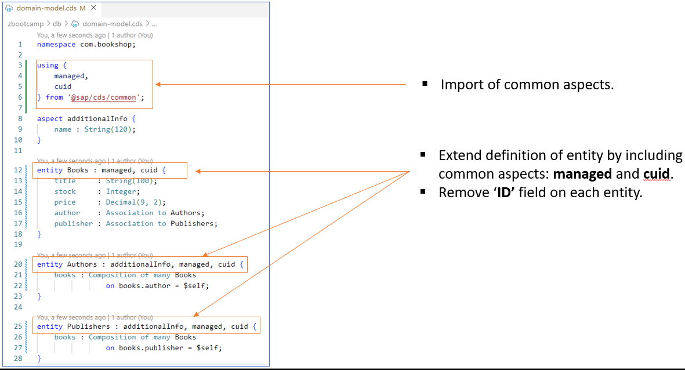
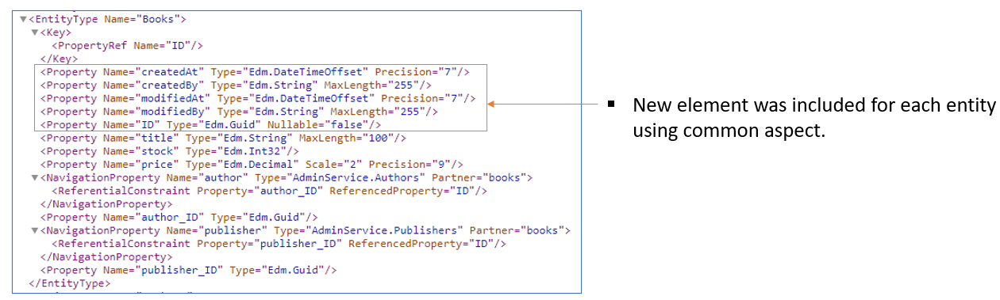
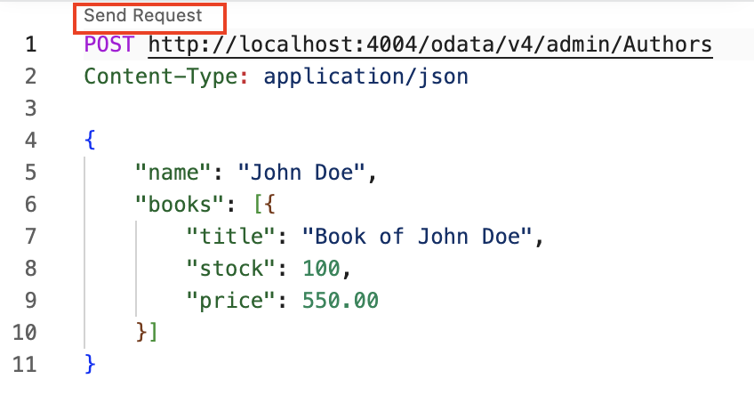
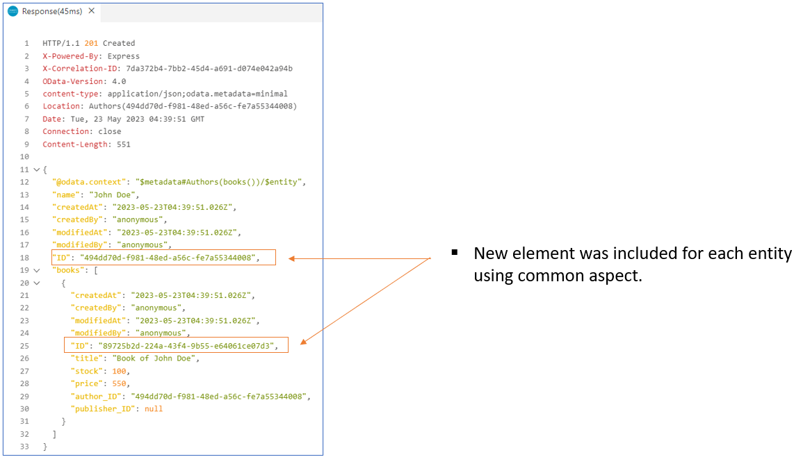

# Day 2 Exercise 3 - Common Aspects
This is a reference of Code for Day 2 Exercise 3

## Import Common Aspects
### Steps
1. Open `db/domain-model.cds`
2. Import the common aspect **managed** and **cuid** for all entities. 
3. Remove `key ID` field for entity **Books**, **Authors** and **Publishers**.
    ```cds
    namespace com.bookshop;

    using {
        managed,
        cuid
    } from '@sap/cds/common';

    aspect additionalInfo {
        name : String(120);
    }

    entity Books : managed, cuid {
        title     : String(100);
        stock     : Integer;
        price     : Decimal(9, 2);
        author    : Association to Authors;
        publisher : Association to Publishers;
    }

    entity Authors : additionalInfo, managed, cuid {
        books : Composition of many Books
                    on books.author = $self;
    }

    entity Publishers : additionalInfo, managed, cuid {
        books : Composition of many Books
                    on books.publisher = $self;
    }
    ```
    <kbd>  </kbd>

## Check Metadata
### Steps
1. Open **terminal** and run `cds watch`.
2. Access the service and click the **/admin/$metadata**
    <kbd>  </kbd>


## Create HTTP Request
### Steps
1. Create **test/HTTP** folder in your root workspace.
2. Create HTTP request with file name **bookshop-request.http** and put under **HTTP** folder.
```http
POST http://localhost:4004/odata/v4/admin/Authors
Content-Type: application/json

{
    "name": "John Doe",
    "books": [{
        "title": "Book of John Doe",
        "stock": 100,
        "price": 550.00
    }]
}
```

3. Click **Send Request** above your **POST <Link>**. Alternatively, you can do **right click** > **Send Request**

<kbd>  </kbd>
<kbd>  </kbd>