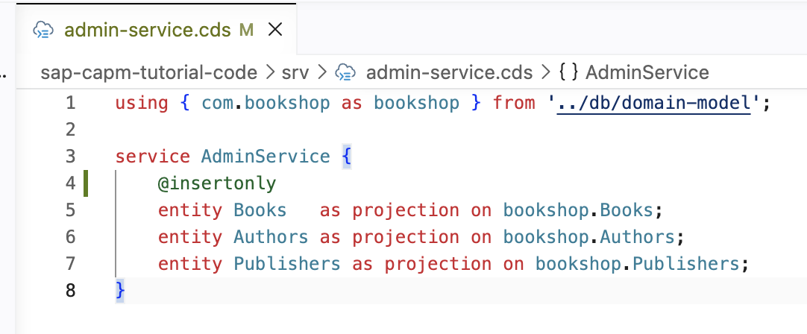
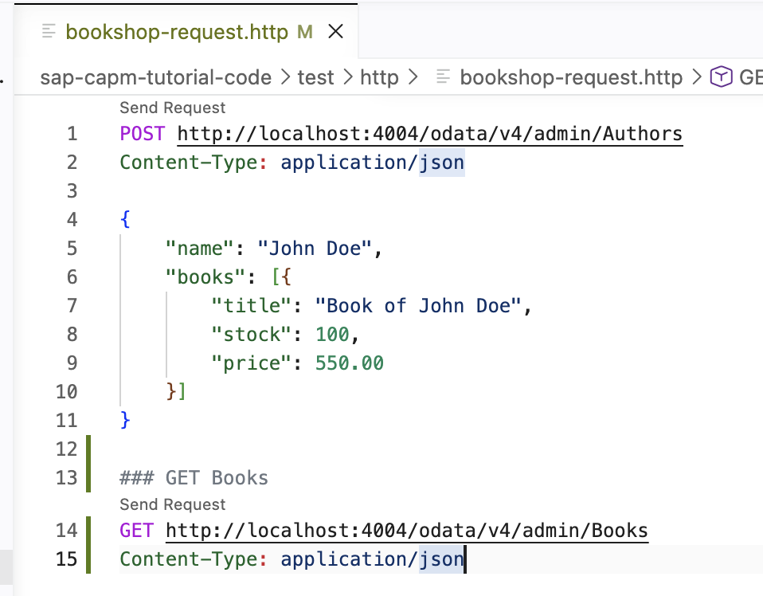
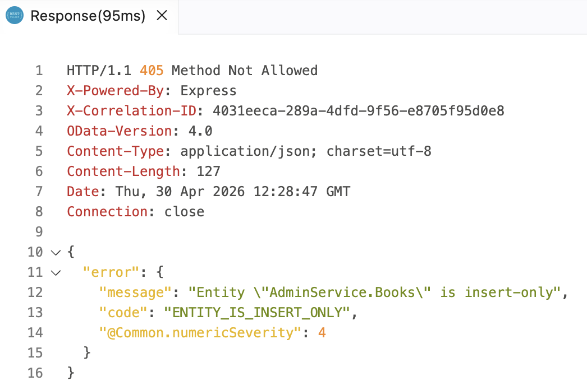
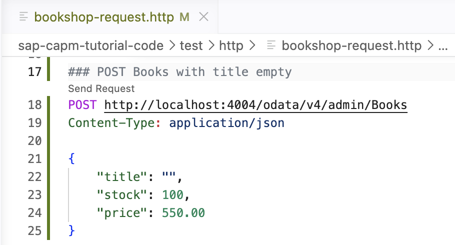
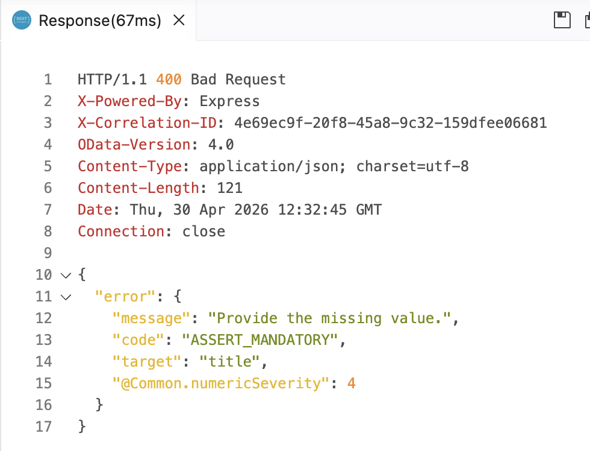

# Day 3 Exercise 1 - Field Validation
This is a reference of Code for Day 3 Exercise 1

## Add Access Control
### Steps:
1. Open **srv/admin-service.cds**
2. Add `@insertonly` before Books entity. 
```cds
@insertonly
```
<kbd> </kbd>

## Add Input Validation
### Steps:
1. Open **db/domain-model.cds.**
2. Append `@mandatory` to `title` and `name` field.
```cds
namespace com.bookshop;

using {
    managed,
    cuid
} from '@sap/cds/common';

aspect additionalInfo {
    name : String(120) @mandatory;
}

entity Books : managed, cuid {
    title     : String(100) @mandatory;
    stock     : Integer;
    price     : Decimal(9, 2);
    author    : Association to Authors;
    publisher : Association to Publishers;
}

entity Authors : additionalInfo, managed, cuid {
    books : Composition of many Books
                on books.author = $self;
}

entity Publishers : additionalInfo, managed, cuid {
    books : Composition of many Books
                on books.publisher = $self;
}
```

## Add New GET HTTP Request
### Steps:
1. Open **test/http/bookshop-request.http**
2. Add **GET HTTP Request** for **Books** entity, and put the request in end of the line.
```http
### GET Books
GET http://localhost:4004/odata/v4/admin/Books
Content-Type: application/json
```
<kbd>  </kbd>

3. Click **Send Request**.

<kbd>   </kbd>

## Add New POST HTTP Request
### Steps
1. Open **test/http/bookshop-request.http**
2. Add **POST HTTP Request** for **Books** entity, and put the request in end of the line.
```http
### POST Books with title empty
POST http://localhost:4004/odata/v4/admin/Books
Content-Type: application/json

{
    "title": "",
    "stock": 100,
    "price": 550.00
}
```
<kbd>  </kbd>

3. Click **Send Request**.

<kbd>  </kbd>