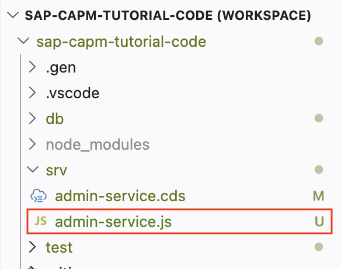
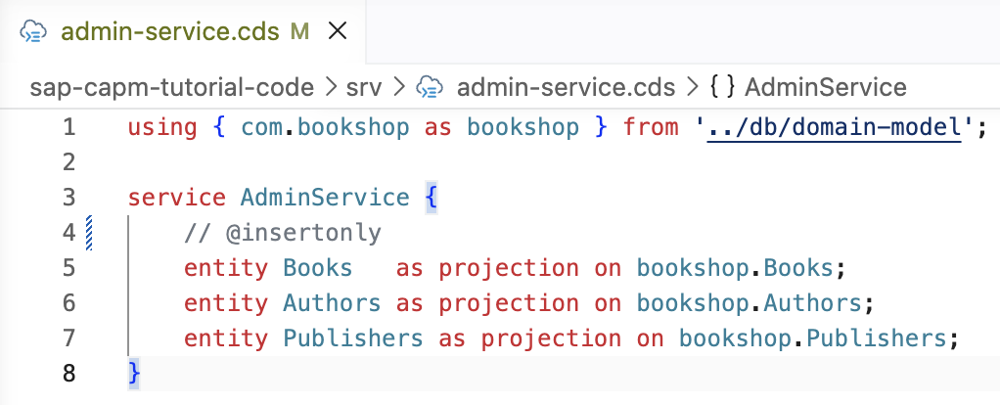
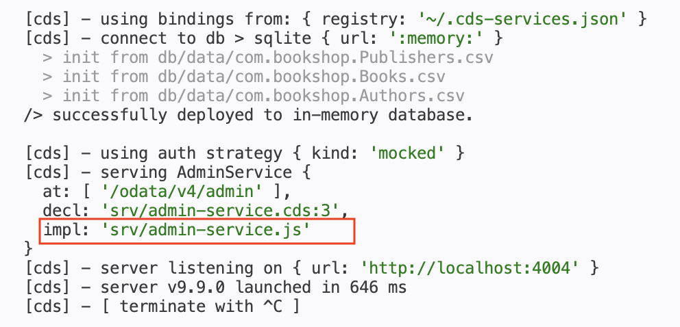
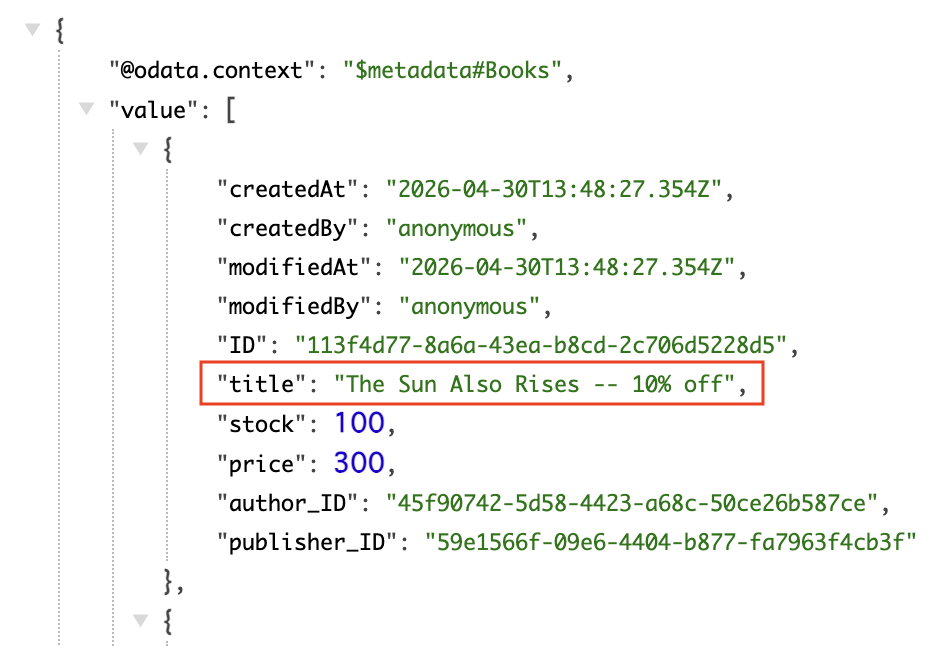
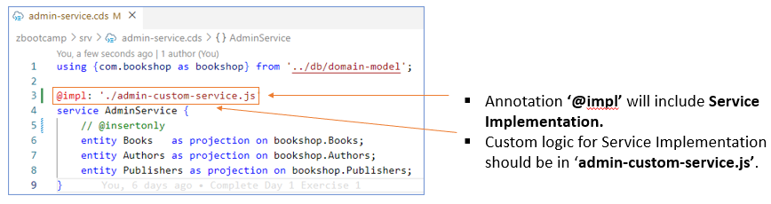
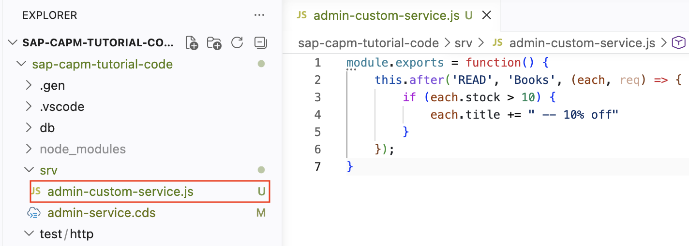
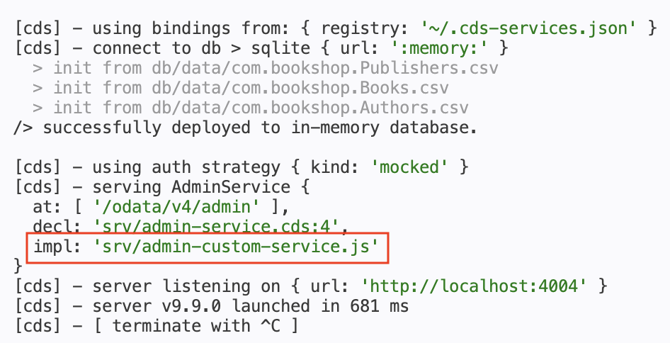
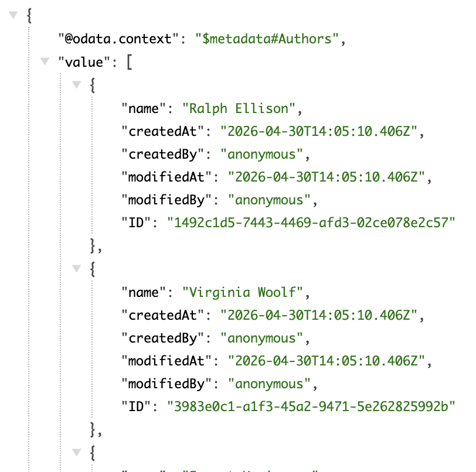

# Day 3 Exercise 2 - Custom Logic
This is a reference of Code for Day 3 Exercise 2

## Create Service Implementation - Define Event Handler - ‘.after’
### Steps:
1. Define a service implementation by creating a file **admin-service.js** in **srv** folder.
<kbd>  </kbd>

2. Open Service Implementation **srv/admin-service.js**
3. Define a custom event handler `this.after`.
    ```js
    module.exports = function() {
        this.after('READ', 'Books', (each, req) => {
            if (each.stock > 10) {
                each.title += " -- 10% off"
            }
        });
    }
    ```

4. If you are using `VS Code`, you need to remove this entry in your `package.json`. Else, if you are using BAS, you can skip this step.

    ```
    "type": "module"
    ```

## Modify Service Definition
Comment-out `@insertonly`
### Steps:
1. Open Service definition **admin-service.cds**.
2. Comment-out the code for `@insertonly` to allow us in executing other HTTP request for **Books** entity.  
```cds
// @insertonly
```
<kbd>  </kbd>

## Run Service
### Steps:
1. Open **terminal** and run `cds watch`.
2. Default service implementation will be used for the **same file name** with Service Definition.
<kbd> </kbd>

3. Query / Access the service using path **/admin/Books.**
<kbd> </kbd>

## Add @impl
### Steps:
1. Open **srv/admin-service.cds**
2. Add annotation **@impl**.
``` cds
@impl: './admin-custom-service.js' 
```
<kbd>  </kbd>

## Rename Service Implementation
### Steps:
1. In `srv` folder, rename the Service Implementation file from **admin-service.js** to **admin-custom-service.js**.
<kbd>  </kbd>

2. Open **terminal** and run `cds watch`.
<kbd> </kbd>

3. Service Implementation still works using **@impl** annotation.
<kbd> </kbd>