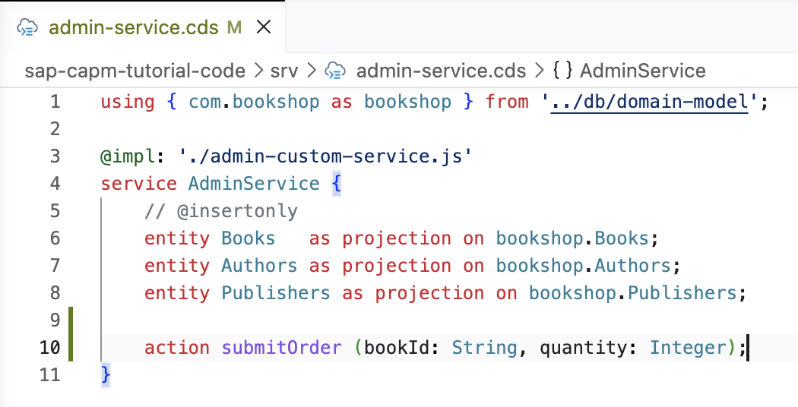
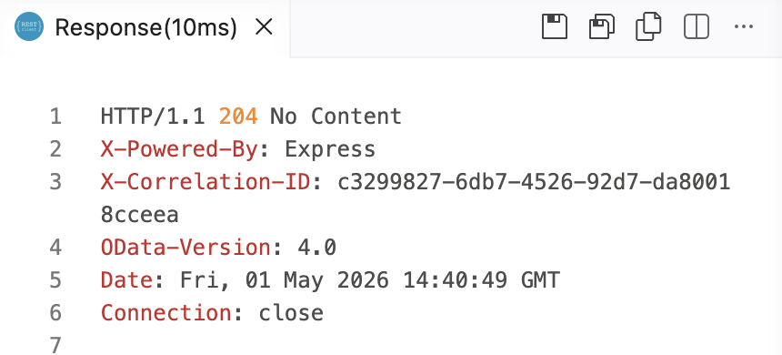
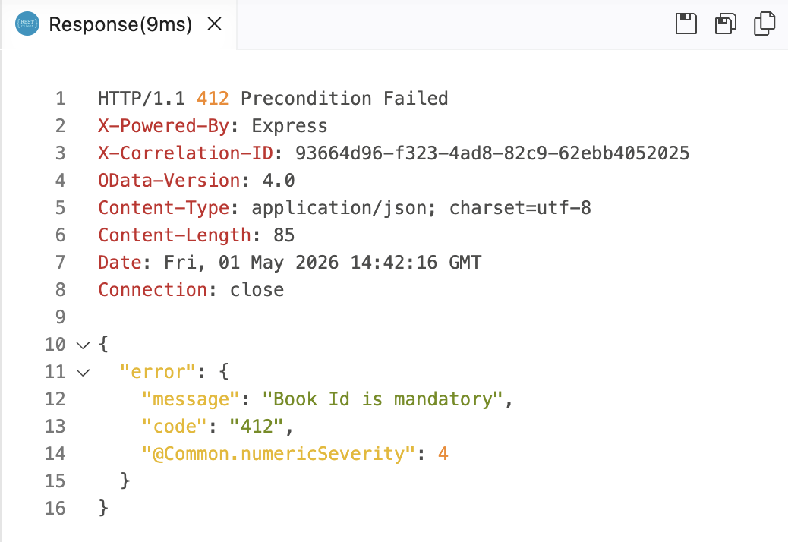
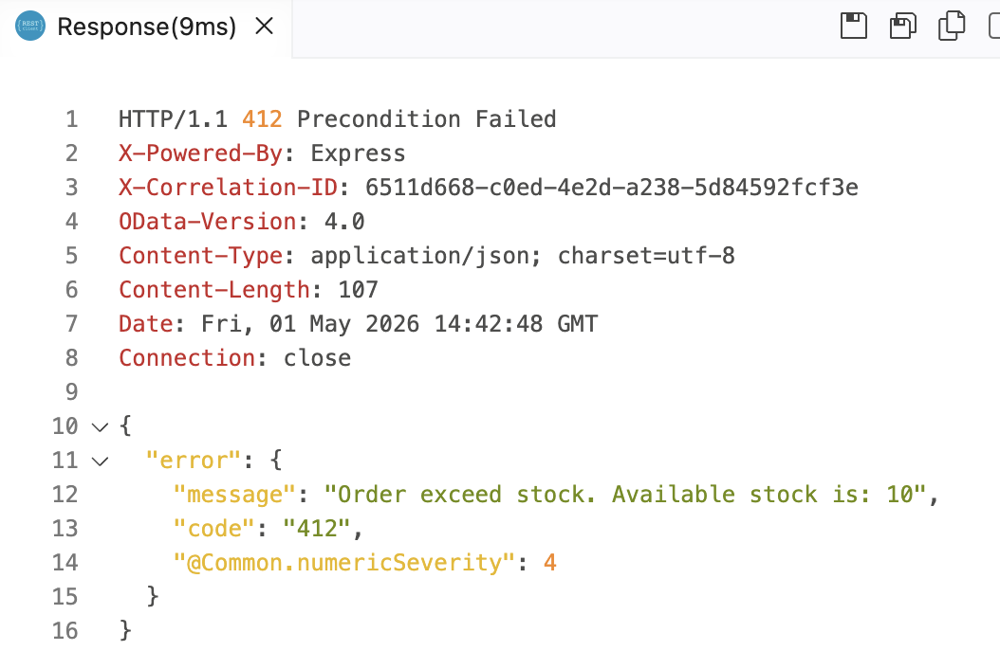

# Day 3 Exercise 3 - Custom Event
This is a reference of Code for Day 3 Exercise 3

## Define Custom Event: Unbound Action
### Steps:
1. Open Service Definition **srv/admin-service.cds**
2. Define custom event **action** in Service Definition.
```cds
action submitOrder (bookId: String, quantity: Integer);
```
<kbd>  </kbd>

## Implementing Action
### Steps:
1. Open Service Implementation **srv/admin-custom-service.js**
2. Define custom event **unbound action** and name it to `submitOrder`.  Put this inside `module.exports` after an existing function.

    ```js
    this.on('submitOrder', async (req) => {
        const { bookId, quantity } = req.data;

        if (!bookId) {
            req.reject(412, 'Book Id is mandatory');
        }
        if (quantity > 10) {
            req.reject(412, 'Order exceed stock. Available stock is: 10');
        }

        return bookId;
    });
    ```

## Add new POST HTTP Request
### Steps:
1. Open **bookshop-request.http**.
2. Add **POST HTTP Request** for `submitOrder`, and put the request in end of the line.
```http
### POST submitOrder - Custom event action
POST http://localhost:4004/odata/v4/admin/submitOrder
Content-Type: application/json

{
    "bookId": "78798e35-25a2-4680-be07-27d1cc8abc43",
    "quantity": 9
}
```

3. Click **Send Request**. These are the possible outcomes once you trigger the POST request. Try
    - Input **quantity** = 15, to trigger the error for **Order exceed stock. Available stock is: 10**.
    - Input **bookId** as emppty value, to trigger the error for **Book Id is mandatory**
    <kbd>  </kbd>
    <kbd>  </kbd>
    <kbd>  </kbd>