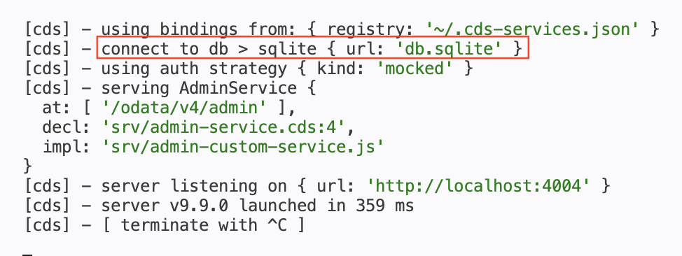
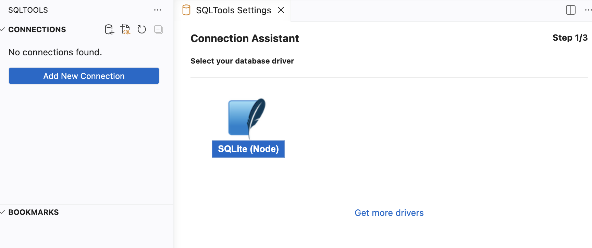
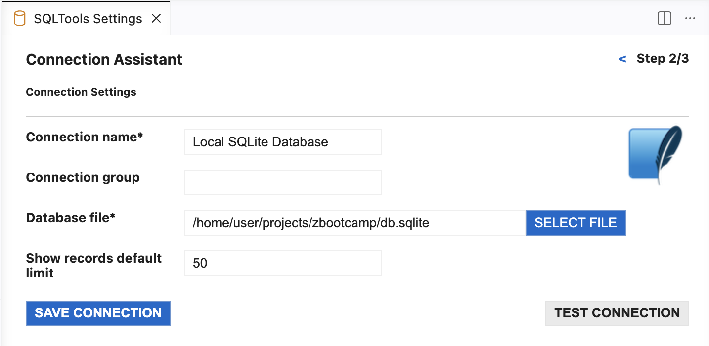
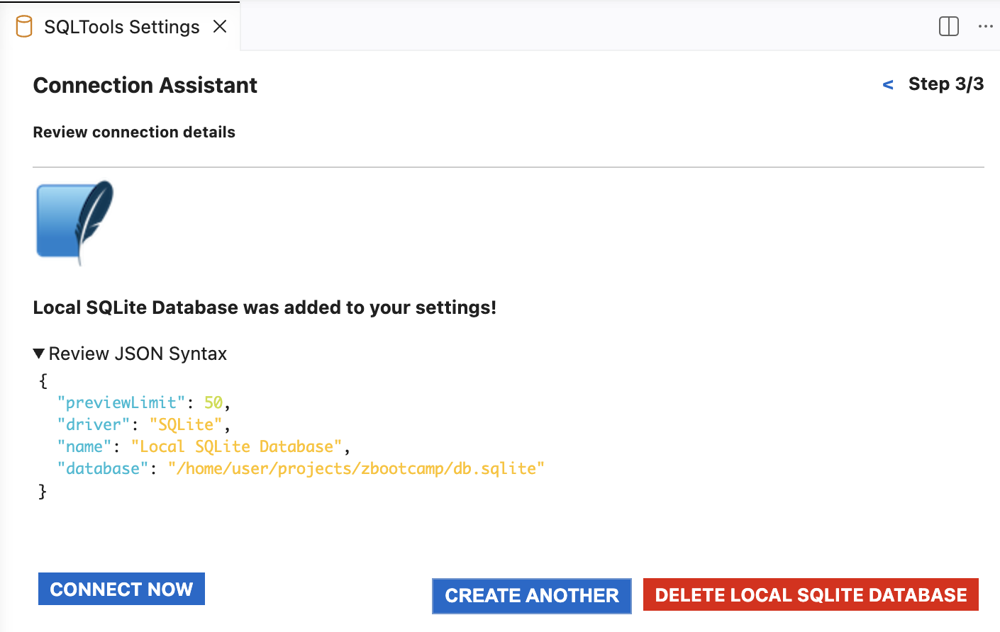
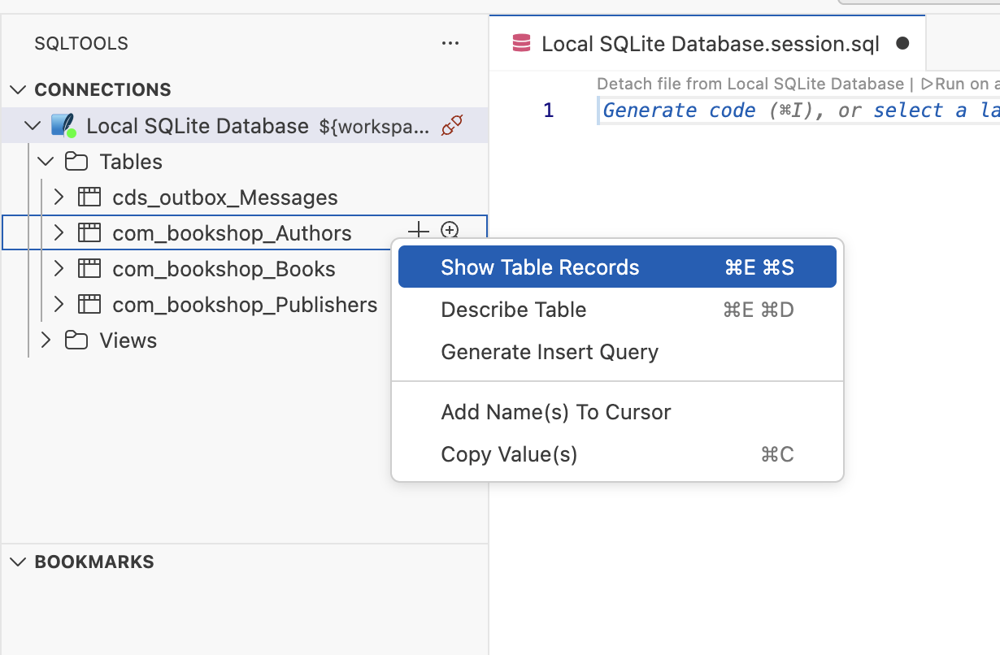
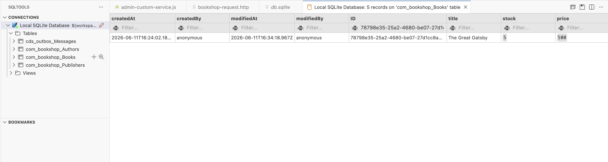

# Day 4 Exercise 1
This is a reference of Code for Day 4 Exercise 1

## Preparation of SQLite
### Deploy to SQLite
1. Open `Terminal` and execute command below.
```cds
cds deploy --to sqlite
```

2. Modify the `package.json` to include the configuration for SQL Database.
```json
{
  "name": "zbootcamp",
  "version": "1.0.0",
  "dependencies": {
    "@sap/cds": "^9"
  },
  "devDependencies": {
    "@cap-js/sqlite": "^2",
    "@sap/cds-dk": "^9"
  },
  "scripts": {
    "start": "cds-serve"
  },
  "cds": {
    "[development]": {
      "requires": {
        "db": {
          "kind": "sqlite",
          "database": "db.sqlite"
        }
      }
    }
  },
  "private": true
}
```

### Service running Persistent Database
1. Run the app using
```
cds watch --profile development
```
2. Service is now using the SQLite Database which will make data persistent.
<kbd> </kbd>

## Setting up the SQL Tools
### Step 1: Setup SQL Tools
1. Click `SQLTools` from the left side menu.
2. Click `Add New Connection`.
3. Select `SQLite (Node)`.
<kbd> </kbd>

### Step 2: Setup SQL Tools
1. Fill-up `mandatory fields` and click `Test Connection`.
  - Connection name: `Local SQLite Database`.
  - Database file: `/home/user/projects/zbootcamp/db.sqlite`.

> Note: Right click your `db.sqlite` and select `Copy path` to get the link of `Database file`. Alternatively, you can type `pwd` in terminal.

2. Click `Save Connection`.
<kbd> </kbd>

### Step 3: Setup SQL Tools
1. Click `Connect Now`.  
<kbd> </kbd>

## Preview
1. The `Tables` and `Views` should now be available after you connect.
2. The `.sql` file will open automatically and allows you to execute query in `SQLite syntax`. This is optional and you can close it.
3. To run a query, **right click** > **Show Table Records**.
  <kbd> </kbd>
4. In the `ID` column, you can filter the exact value.
  <kbd> </kbd>
