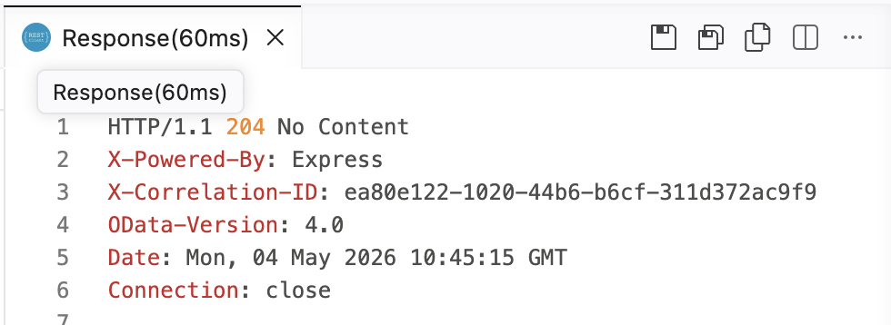
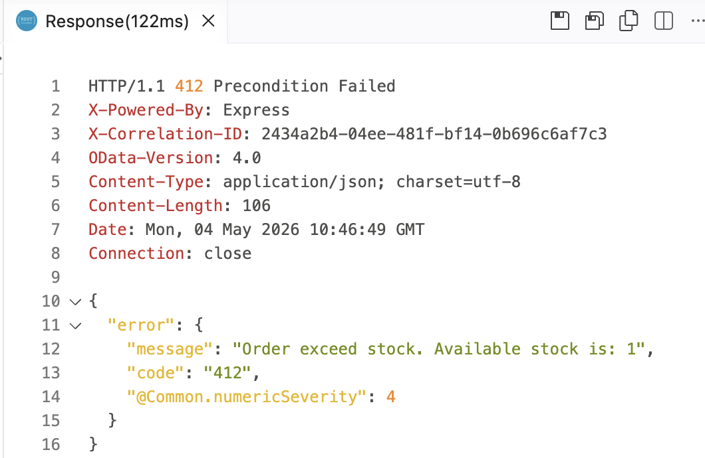
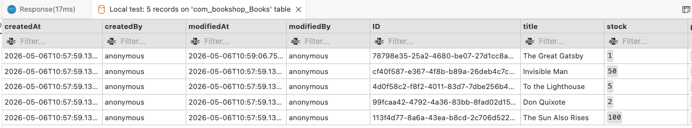

# Day 4 Exercise 3
This is a reference of Code for Day 4 Exercise 2

## Enhanced **submitOrder** custom event
### Steps
1. Open `srv/admin-custom-service.js` and modify the custom event `submitOrder`.
2. Modification includes using of `CQL`.
```js
this.on('submitOrder', async (req) => {
    const { bookId, quantity } = req.data;
    const { Books } = cds.entities;
    const bookResponse = await SELECT.one(Books).where({ ID: bookId });
    if (!bookResponse) {
        req.reject(412, 'Book Id is invalid');
    }
    if (bookResponse.stock <= 0) {
        req.reject(412, 'Out of stock!');
    }
    if (quantity > bookResponse.stock) {
        req.reject(412, `Order exceed stock. Available stock is: ${bookResponse.stock}`);
    }
    return await UPDATE(Books, bookId).set({
        stock: bookResponse.stock - quantity
    });
});
```

## Add new POST HTTP Request
### Steps
1. Open `bookshop-request.http`.
2. Add `POST HTTP` Request for `Books` entity, and put the request in end of the line.
3. Click `Send Request`.

```http
### POST Books
POST http://localhost:4004/odata/v4/admin/submitOrder
Content-Type: application/json

{
    "bookId": "78798e35-25a2-4680-be07-27d1cc8abc43",
    "quantity": 9
}
```

## Response from HTTP Request
### Success Response
<kbd> </kbd>

### Error Response
To achive this error, kindly send again a **POST Request**
<kbd> </kbd>

## Database record updated
1. After executing `HTTP request`, the local database should be updated.<br>   
<kbd>  </kbd>