# Day 5 Exercise 1
This is a reference of Code for Day 5 Exercise 1

## Add SAP Fiori Project
### Steps
1. In `BAS`, open command palette (`Shift + Command + P for MAC` / `Ctrl + Shift + P for WIN`). Choose `Fiori: Open Application Generator`.<br>  
<kbd> 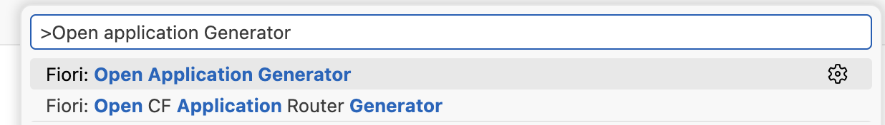</kbd>

## Template Selection
### Step
1. Select `List Report Page` from Template Selection. Click `Next`.<br>  
<kbd> 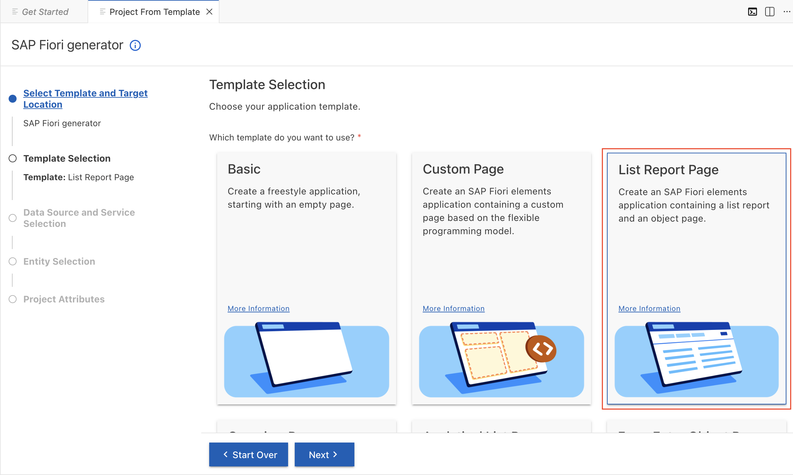</kbd>

## Data Source and Service Selection
### Step
1. Fill-up the following fields to define the data source, which will use the existing CAP Project. Click **Next**.
    - Data source: **Use a Local CAP Project**
    - Choose your CAP project: **zbootcamp**
    - OData service: **AdminService (Node.js)**

    <kbd> 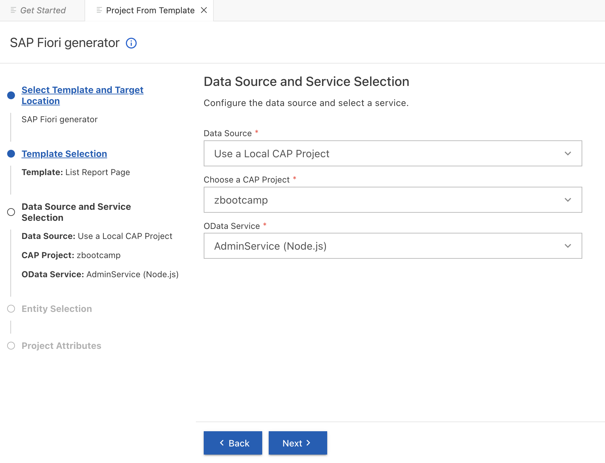</kbd>

## Entity Selection
### Step
1. Select the entity `Books` as our main entity and select `Responsive` for Table type. Click **Next**. <br>    
<kbd> 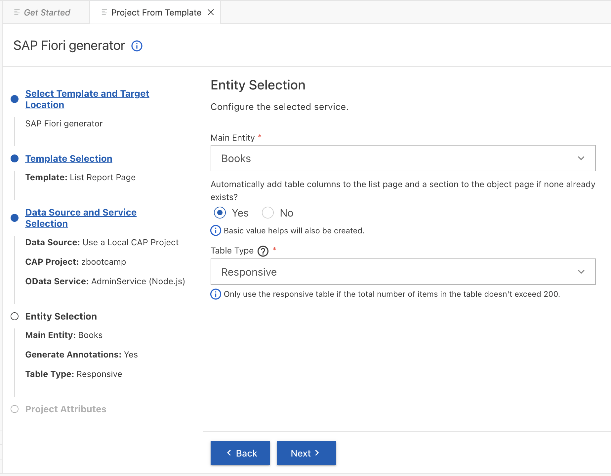</kbd>

## Project Attributes
### Step
1. Fill-up the following fields to define project attributes and click **Next**.
    - Module name: **report**
    - Application title: **Bookshop Report**
    - Application namespace: **com.ui.bookshop**
    - Description: **A Fiori application for Bookshop**
    - Minimum SAPUI5 version: **1.147.2.0**
    - Enable TypeScript: **No**
    - Add deployment configuration to MTA project: **Yes**
    - Add FLP configuration: **No**
    - Use Virtual Endpoints for Local Preview: **Yes**
    - Configure advanced options: **No**

    <kbd> 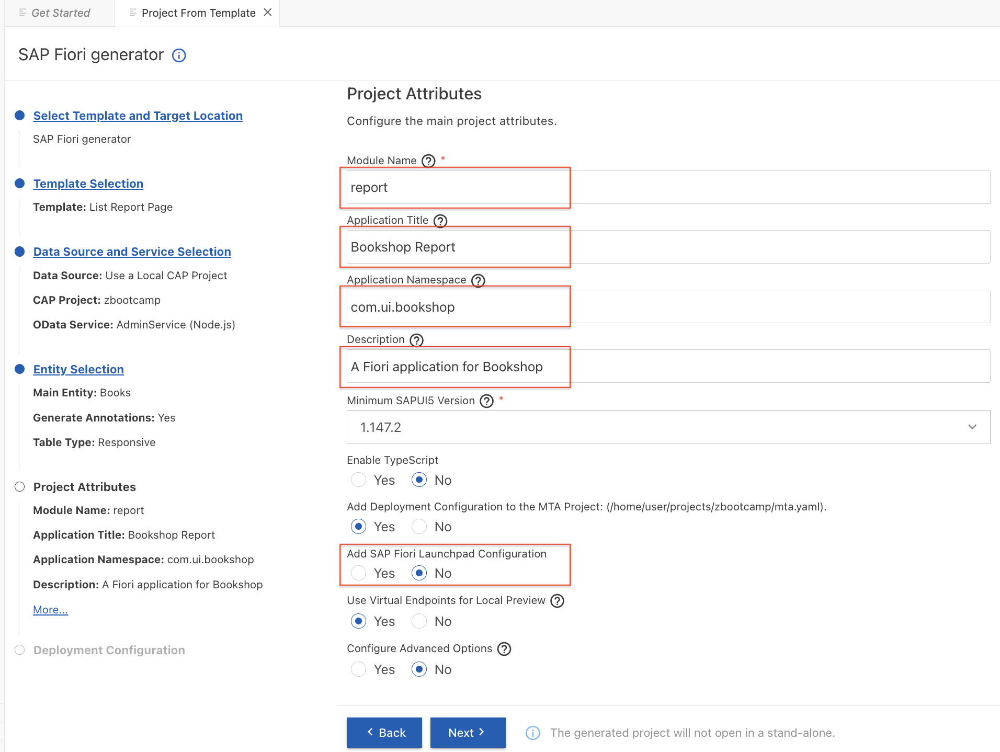</kbd>

## Deployment Configuration
### Step
1. Fill-up the following fields to define the deployment configuration. Click **Finish**.
    - Please choose the target: **Cloud Foundry**
    - Destination name: **None**
 
    <kbd> 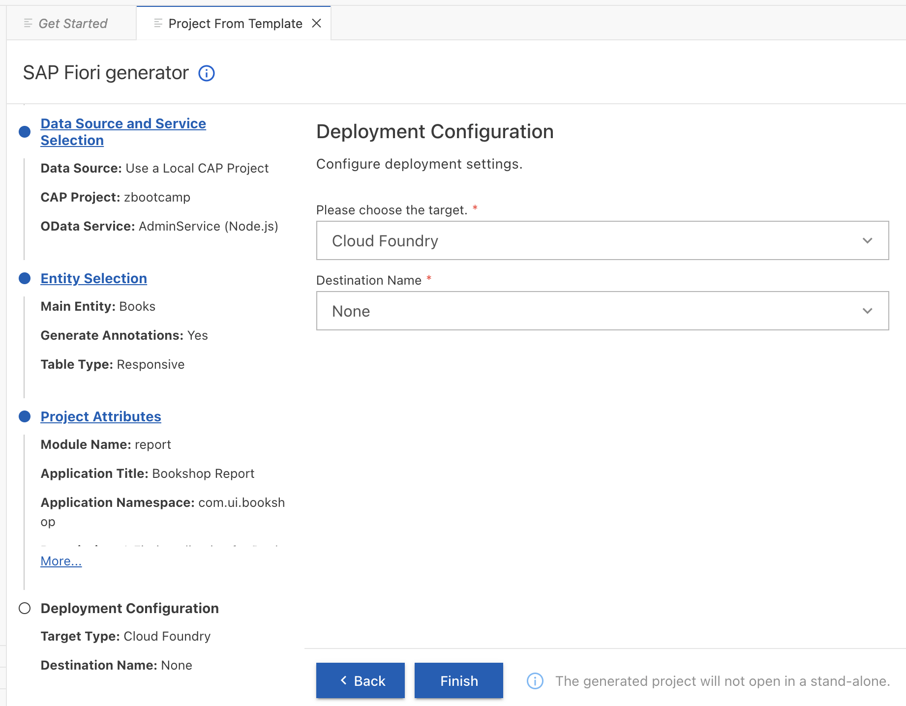</kbd>
    
 ## Summary of Generated Fiori Project
It will take a while to generate the UI components. After that, a summary of Generated Fiori Project will be displayed.
<kbd> 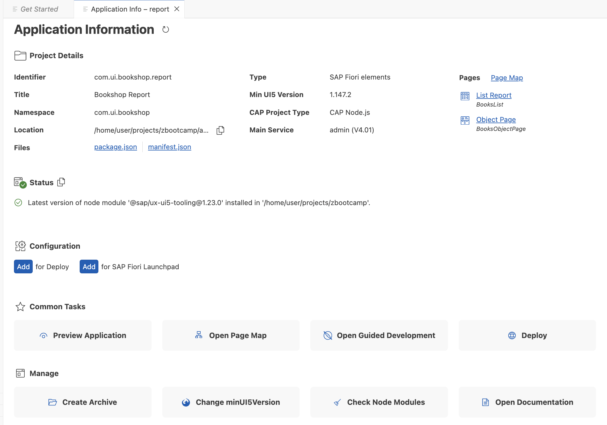</kbd>
 
 ## Project Structure
 ### Explanation
 The generated Fiori App is created under `/app` folder of `CAP service`.
<kbd> 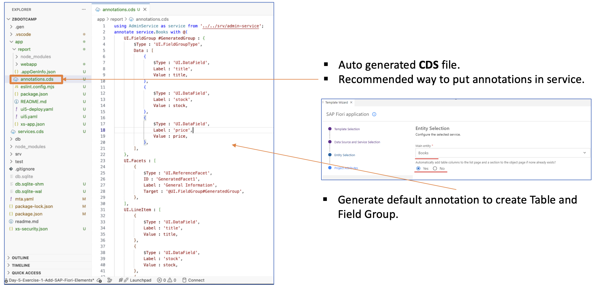</kbd>

## Run your project
### Steps
1. Open terminal and run.
    ```cds
    cds watch
    ```
2. Select the link inside Web Application.<br>   
<kbd> 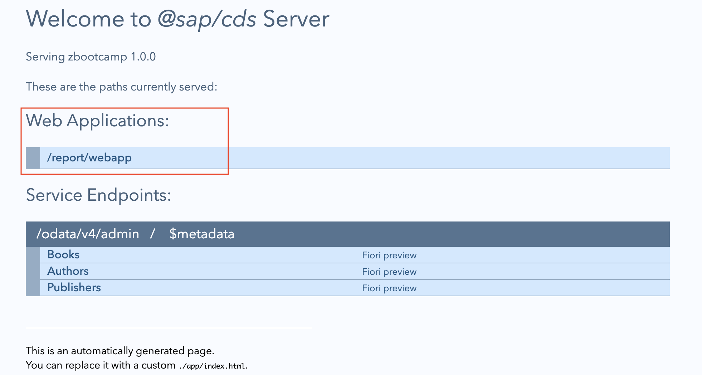</kbd>
    > The Fiori App is now recognized by the service.<br>   
    > The Fiori Preview will launch Fiori App to check the annotation of each entity.
    > Use only for development purposes.

3. Preview App<br>   
<kbd> 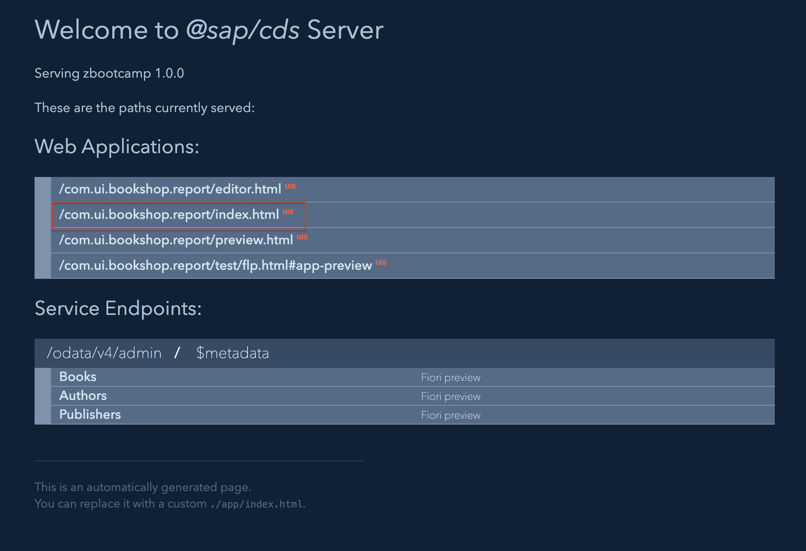</kbd>

4. Click **Go** button to preview the data. <br>   
<kbd> 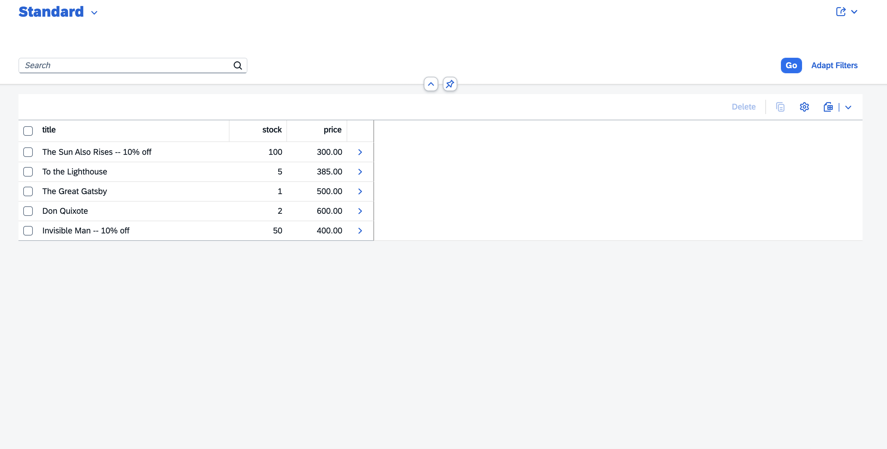</kbd>