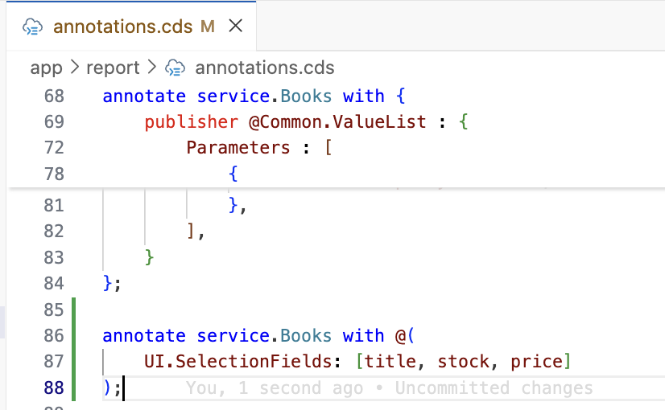
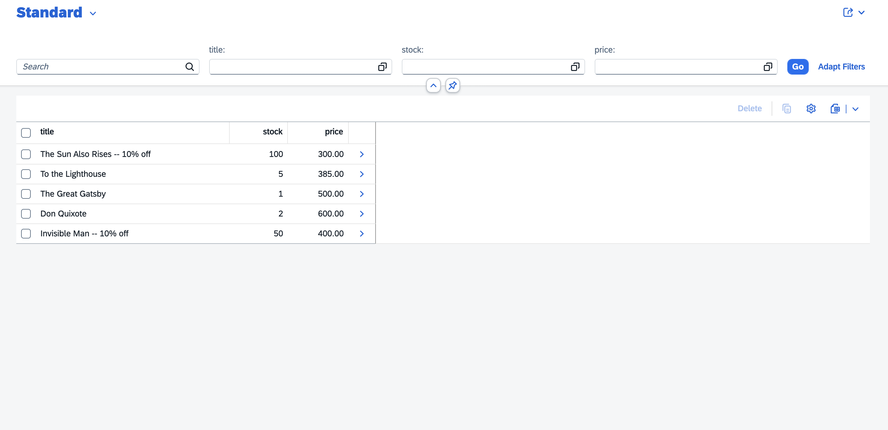
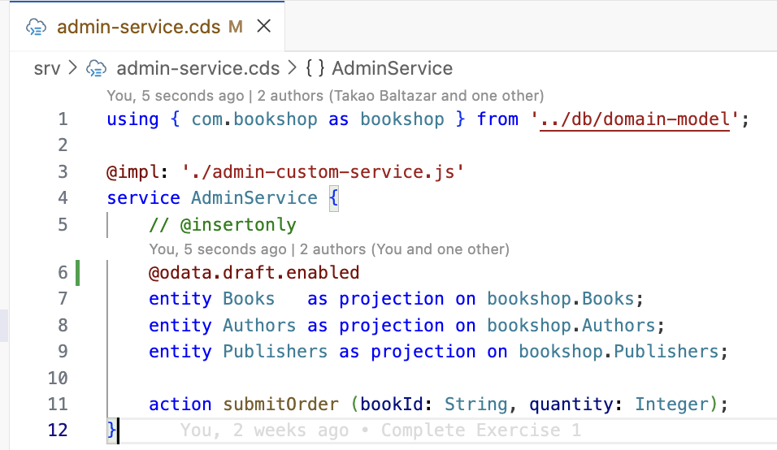
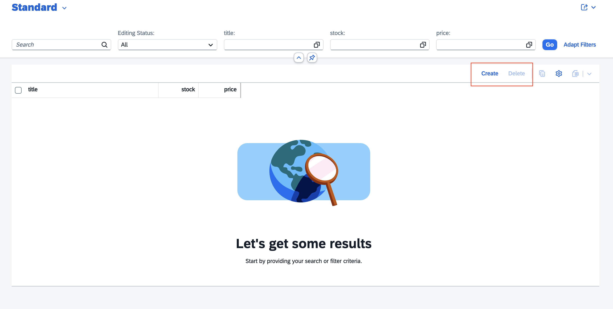
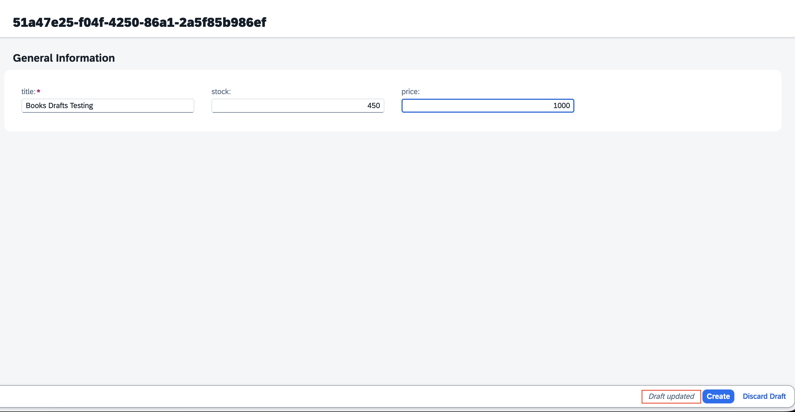
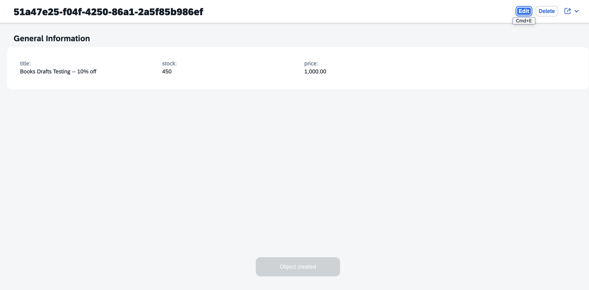
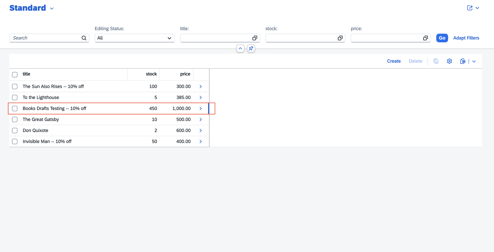
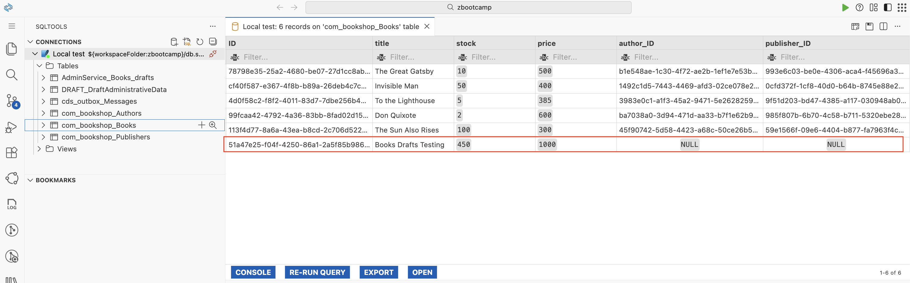

# Day 5 Exercise 2
This is a reference of Code for Day 5 Exercise 2

## Add annotation for Selection Fields
### Steps
1. Open `annotation.cds` in `app` > `report` folder path. 
2. Add annotations to service `Books` in end of the line.
```cds
annotate service.Books with @(
    UI.SelectionFields: [title, stock, price]
);
```

<kbd> </kbd>
> The `SelectionFields` annotation will include filter bar.

<br>   

## Preview App with Selection Fields
### Steps
1. The `Filter Bar` will be displayed to allow filtering of data in table. <br>   
<kbd> </kbd>

## Enable Draft
### Steps
1. Open `srv/admin-service.cds`.
2. Enable Draft to `Books` entity by adding `annotation` to Service Definition.
    ```cds
    @odata.draft.enabled
    ```
    <kbd> </kbd>

3. Next is to `re-build` our local database. Execute the command below in `terminal`. Terminate the terminal by using `ctrl + c`, then execute the command below.
    ```cds
    cds build
    cds deploy –to sqlite srv
    ```

## Enable Draft : Create and Delete
### Steps
1. **Create** and **Delete** button is enabled to create entry for `Books` entity.
2. Click **Create** button. <br>  
<kbd> </kbd>

## Enable Draft: Create Entry
### Steps
1. Fill-up required fields. An Indicator `Draft updated` once you start to fill-up the forms.
    - title: **Books Draft Testing**
    - stock: **450**
    - price: **1000**
3. Click **Create.**
<kbd> </kbd>

## Enable Draft: Entry Created
### Steps
1. Once entry is submitted, the record will be displayed. You can click **Edit** in case you want to edit the record.
2. Go back to home using **browser back button**.<br>    
<kbd> </kbd>

## Enable Draft: View created entry
### Description
1. Entry updated with new record.
<kbd> </kbd>

## Database record updated
### Description
1. New record is created in local database. 
<kbd> </kbd>