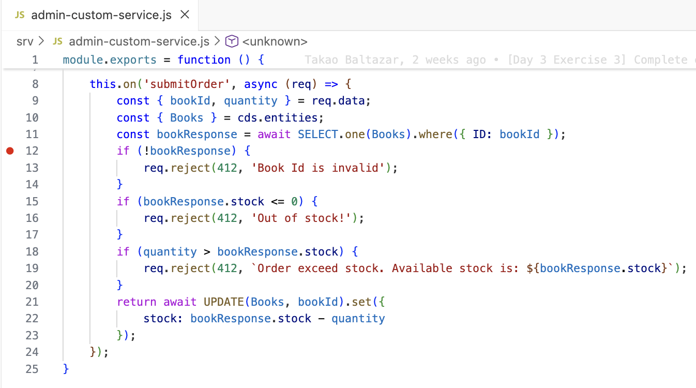
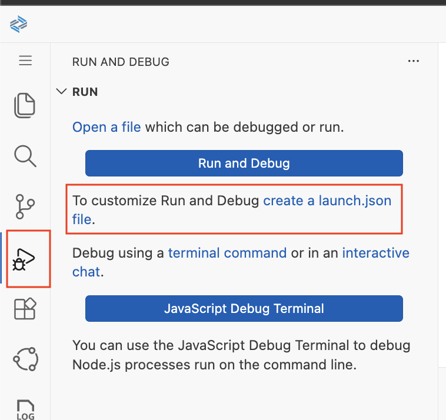
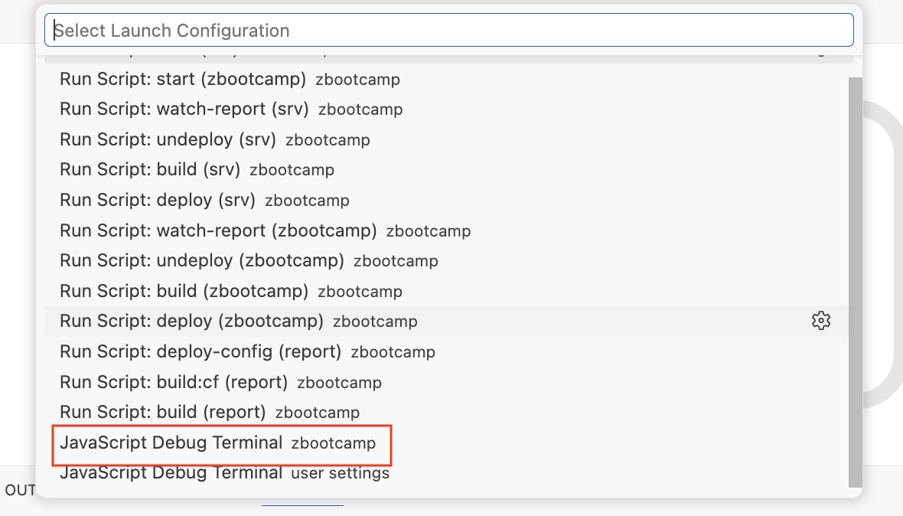
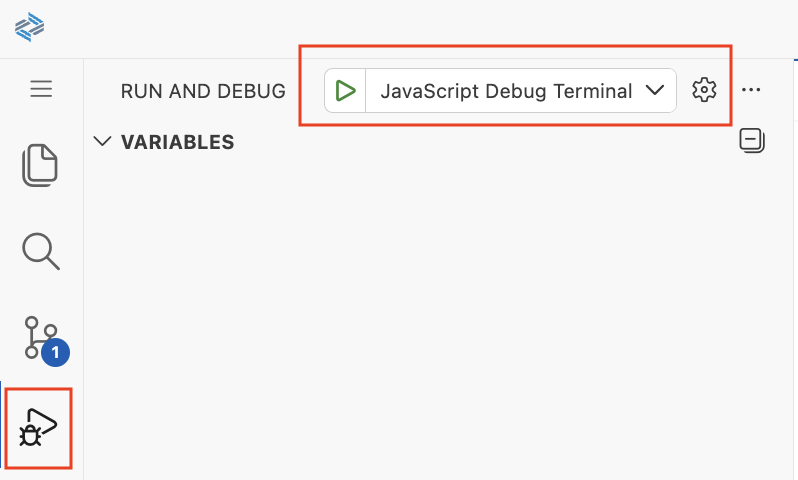
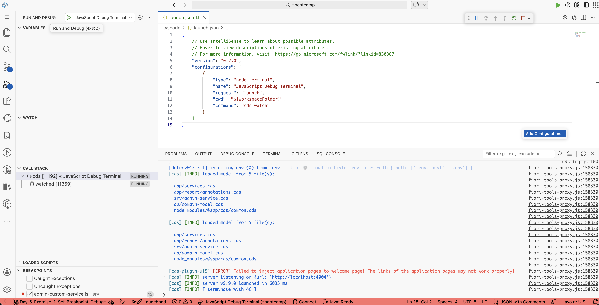
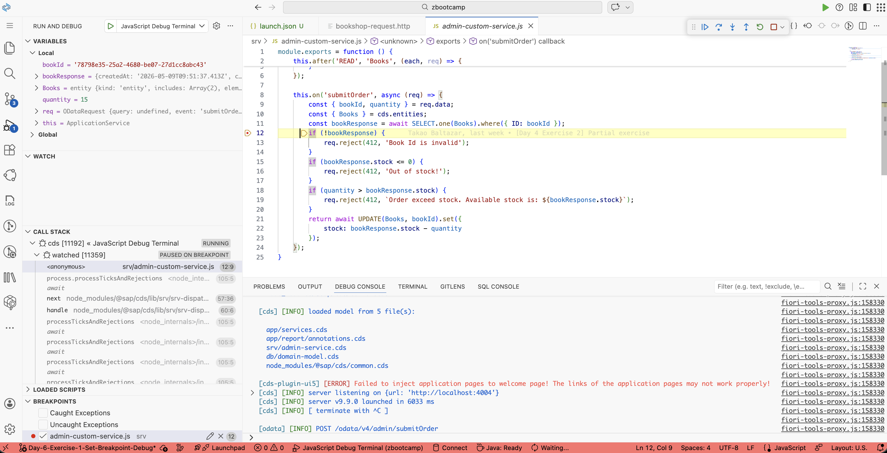

# Day 6 Exercise 1
This is a reference of Code for Day 6 Exercise 1

## Set Breakpoint
### Steps
1. Open `srv/admin-custom-service.js`.
2. Set `breakpoint` in `submitOrder` custom event by **clicking** beside the `line number`.
<kbd> </kbd>

## Activate Debugging
### Steps
1. Open `Run and Debug` menu, and click `create a launch.json file`.
<kbd> </kbd>

2. A pop-up will open and select the option `More Node.js options`.
<kbd> </kbd>

3. In Launch Configuration, select `Javascript Debug Terminal: zbootcamp`.
<kbd> </kbd>

4. Once completed, it will create a file `launch.json`. Add this code inside the configurations object `"command": "cds watch"` and save it.
    ```js
    {
        // Use IntelliSense to learn about possible attributes.
        // Hover to view descriptions of existing attributes.
        // For more information, visit: https://go.microsoft.com/fwlink/linkid=830387/'
        "version": "0.2.0",
        "configurations": [
            {
                "type": "node-terminal",
                "name": "JavaScript Debug Terminal",
                "request": "launch",
                "cwd": "${workspaceFolder}",
                "command": "cds watch"
            }
        ]
    } 
    ```
5. Now, go back again to `Run and Debug` menu and click the debug / play `JavaScript Debug Terminal`.

    <kbd> </kbd>


## Debug mode active
### Steps
1. `Debug mode` is now activated.<br>   
<kbd> </kbd>

## Run existing HTTP Request
### Steps
1. Run your existing HTTP Request for POST `submitOrder`.
    ```http
    ### POST submitOrder - Custom event action
    POST http://localhost:4004/odata/v4/admin/submitOrder
    Content-Type: application/json

    {
        "bookId": "78798e35-25a2-4680-be07-27d1cc8abc43",
        "quantity": 15
    }
    ```

## Debugging Mode
### Description
After running an `HTTP Request`, and setting up breakpoint, you can now debug the code. 
<kbd> </kbd>

