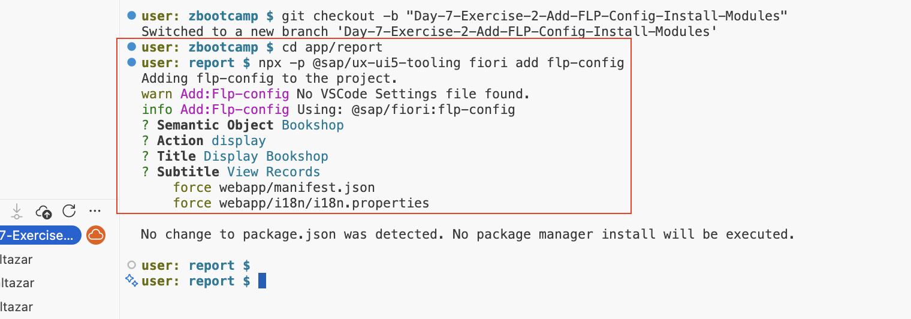

# Day 7 Exercise 3
This is a reference of Code for Day 7 Exercise 2

## Add FLP Config
### Steps
1. To support our app For Fiori Launchpad Service, we need to add an **FLP Config**.
2. Open **terminal** and execute the command below:
    ```cds
    cd app/report
    npx -p @sap/ux-ui5-tooling fiori add flp-config
    ```
    <kbd> </kbd>

    > After executing the command to configure the FLP Config, the **manifest.json** file will be modified:
   
    <kbd> </kbd>


## Re-deploy application to SAP BTP
### Steps
1. Right click **mta.yaml** then click **Build MTA Project**.<br>   
<kbd> </kbd>  

2. Go to `mta_archives` folder. Right click the **.mtar file** > **Deploy MTA Archive**.<br>   
<kbd> </kbd>  