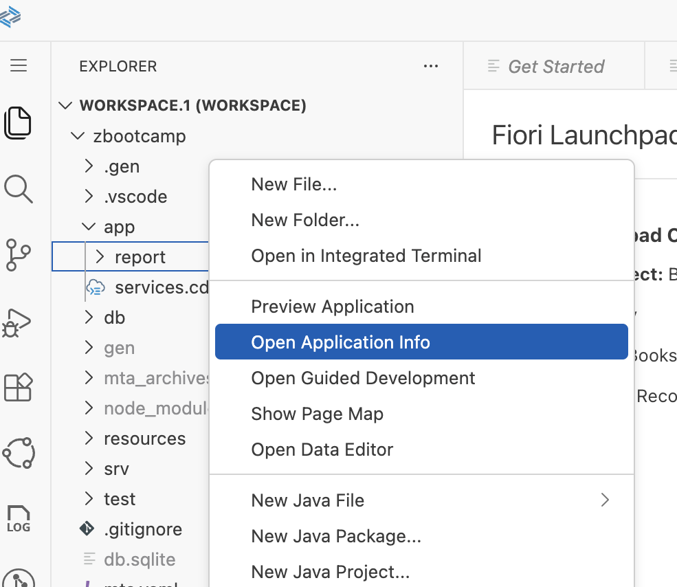
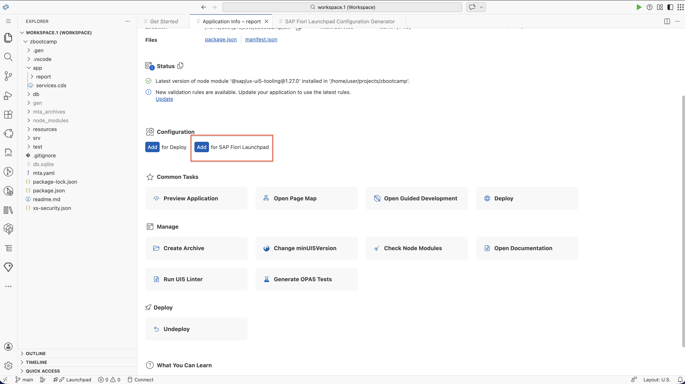
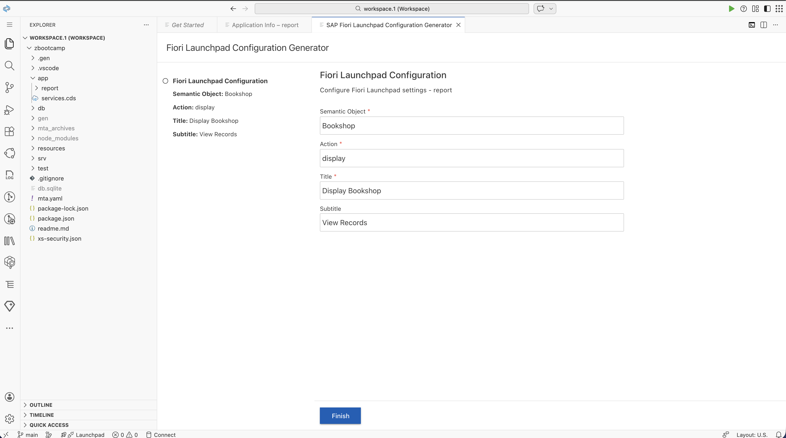
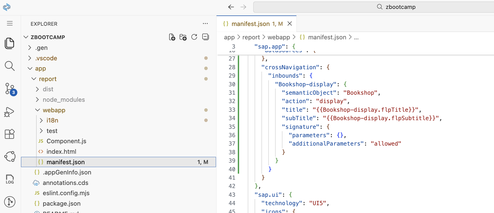
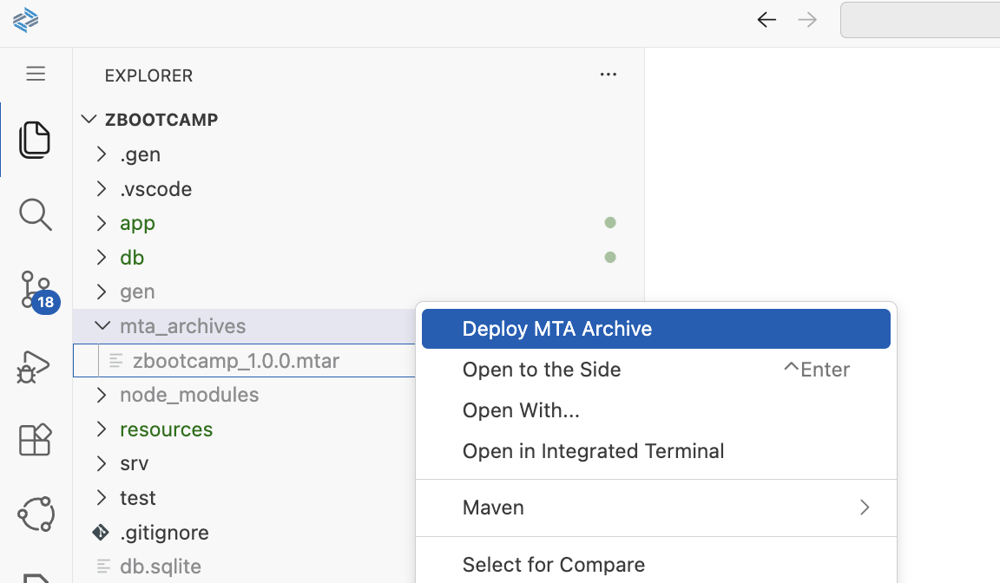

# Day 7 Exercise 2
This is a reference of Code for Day 7 Exercise 2

## Add FLP Config
### Steps
1. To support our app For Fiori Launchpad Service, we need to add an **FLP Config**.

2. In your workspace, navigate to `zbootcamp` -> `app` -> `report`. Then `right click` the folder and choose `Open Application Info`.
    <kbd> </kbd>

3. Click `Add for SAP Fiori Launchpad`.

    <kbd> </kbd>

4. Fill-up the following details:
    - Semantic Object: `Boookshop`
    - Action: `display`
    - Title: `Display Bookshop`
    - Subtitle: `View Records`

    <kbd> </kbd>

    > After setting up the configuration of FLP Config, the **manifest.json** file will be modified:
   
    <kbd> </kbd>

## Re-deploy application to SAP BTP
### Steps
1. Right click **mta.yaml** then click **Build MTA Project**.    
<kbd> </kbd>  

2. Go to `mta_archives` folder. Right click the **.mtar file** > **Deploy MTA Archive**.    
<kbd> </kbd>  