# Day 7 Exercise 3 - Setup SAP BTP Work Zone
This is a reference of Code for Day 7 Exercise 4

## Access Work Zone
1. Go to SAP BTP Cockpit and go to **Services** > **Instances and Subscription** > **SAP Build Work Zone, standard edition.**
<kbd> 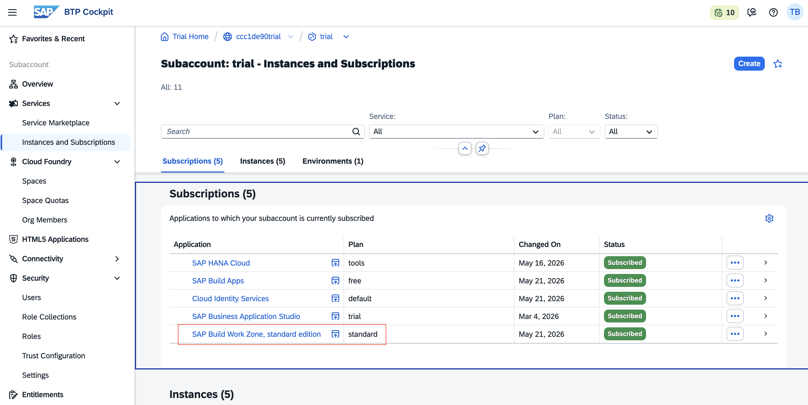</kbd>  

## Setup Site / FLP
### Create Site
### Steps

1. Click **Create Site**.               
<kbd> 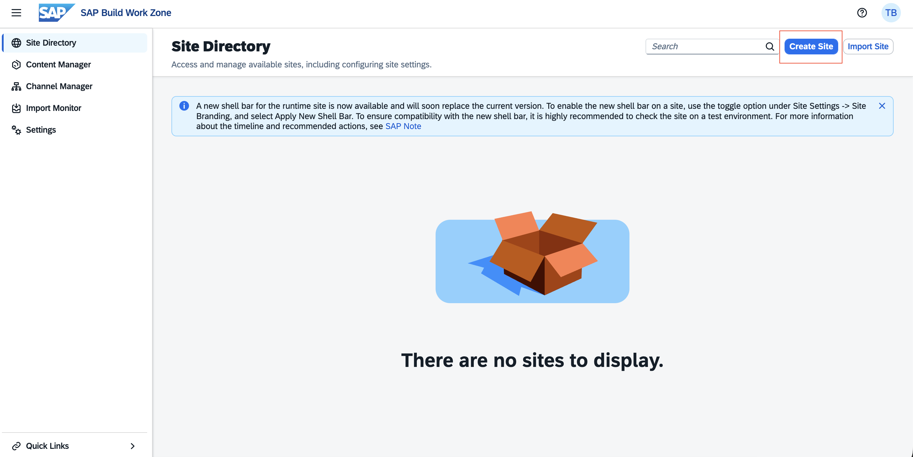</kbd>  

2. Enter **Site Name** and click **Create**.   
<kbd> 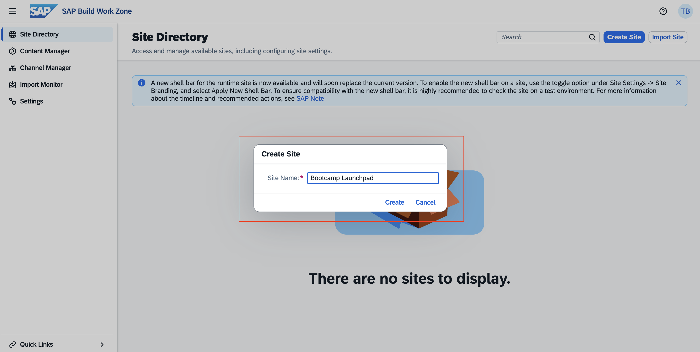</kbd>  

3. **Site / Launchpad** is now created.
<kbd> 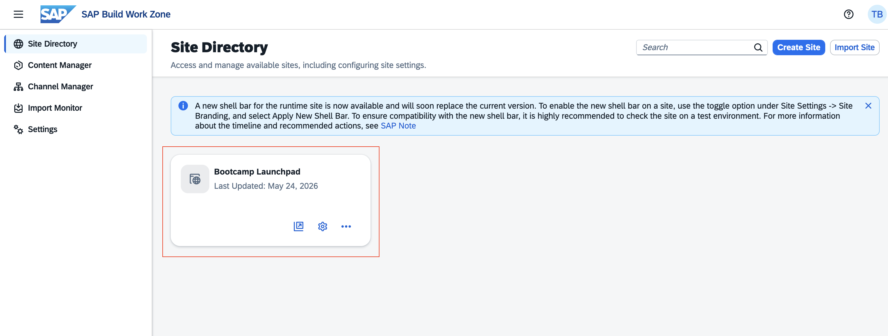</kbd> 

4. Go to **Channel Manager** on the side menu and click the **Refresh icon** under Action column.
<kbd> 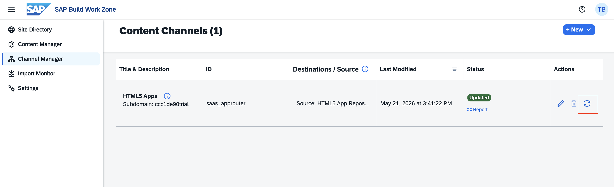</kbd> 

5. Now Go to **Content Manager** on the side menu and click **Content Explorer**.
<kbd> 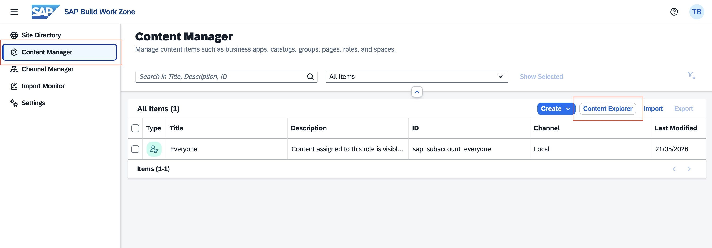</kbd> 

6. Click **HTML5 Apps**.
<kbd> 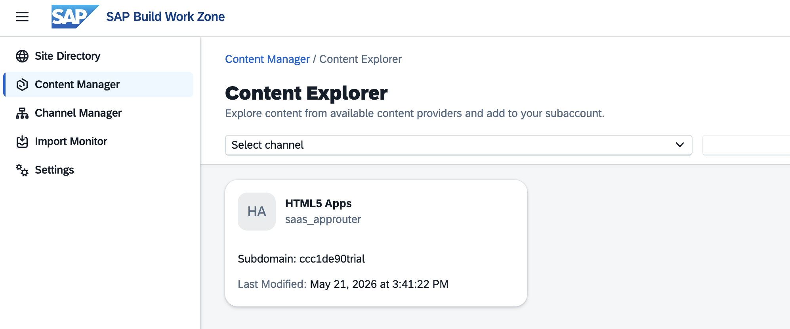</kbd> 

7. Select the item **Bookshop Report** and click the button **Add** button on the upper right screen.
<kbd> 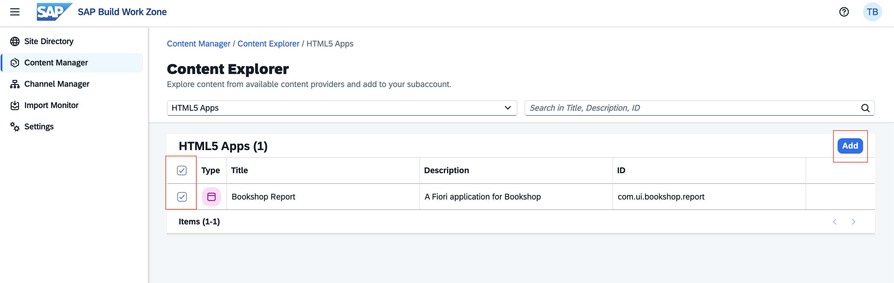</kbd> 

8. The HTML5 apps should now be available in `Content Manager`.
<kbd> 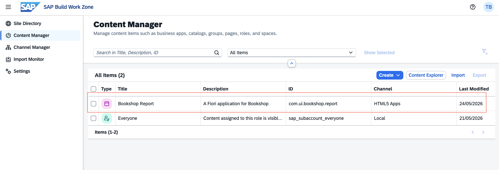</kbd>

### Create Catalog
#### Steps

1. Under `Content Manager`, Click **Create** > **Catalog**.
<kbd> 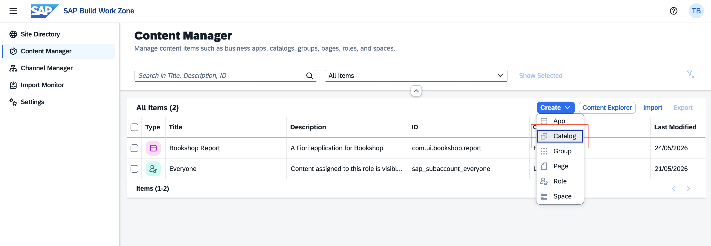</kbd>

2. Enter **Title** and **Description**. Assign the app by clicking the **Assignment status** 
    - Title: **Bookshop Catalog**
    - Description: **A Bookshop Catalog**

    <kbd> 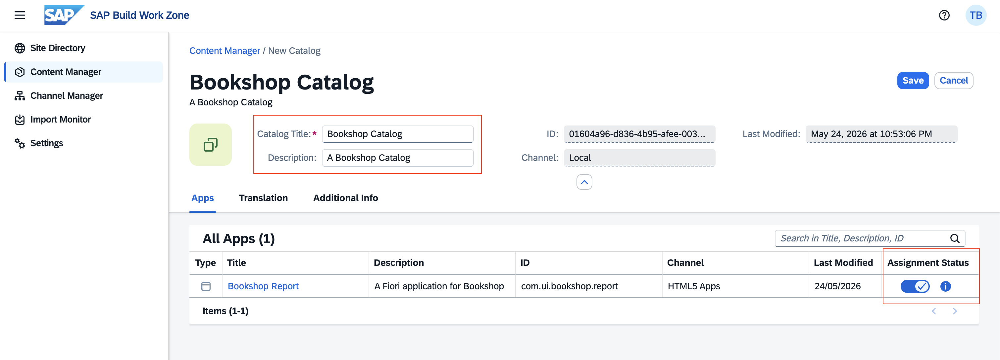</kbd>

3. Click **Save** and go back to **Content Manager**.

### Create Group
#### Steps

1. Under `Content Manager`, Click **Create** > **Group**. You should now be able to see the **Bookshop Catalog** we created.
 <kbd> 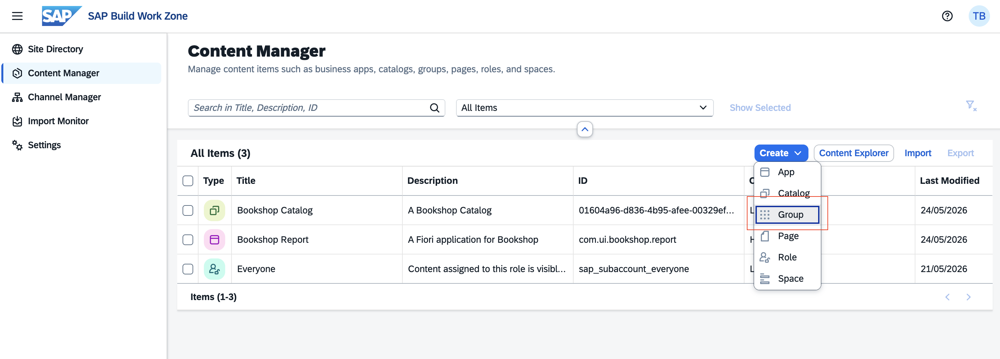</kbd>

14. Enter **Title** and **Description**. Assign the app by clicking the Assignment status
    - Title: **Bookshop Group**
    - Description: **A Bookshop Group**

    <kbd> 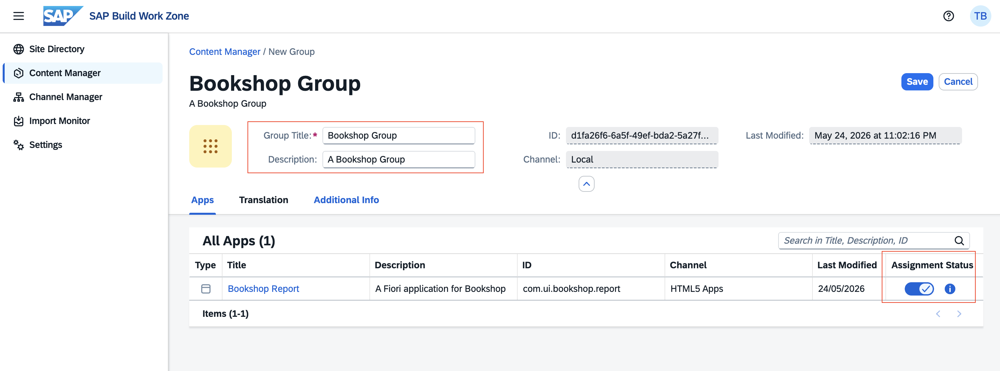</kbd>

16. Click **Save** and go back to **Content Manager**.

### Setup Role
#### Steps

17. After we configure the **Catalog** and **Group**, we will setup the **role**.
18. For role, Open **Everyone** from the table list. 
<kbd> 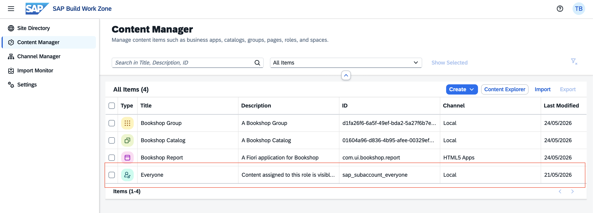</kbd>

19. Click **Edit**. Assign the app by clicking the Assingment status.
<kbd> 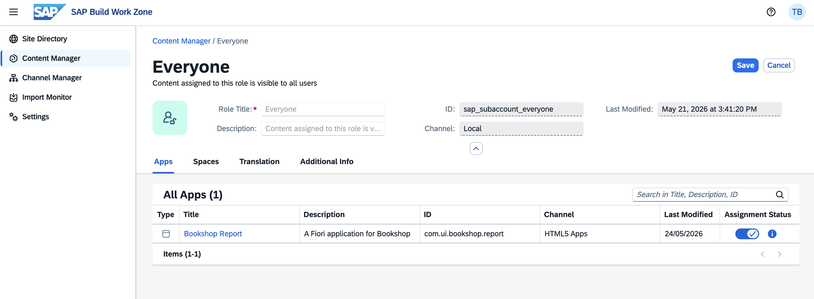</kbd>

21. Click **Save** and go back to **Site Directory**.

### Access Site / FLP
1. Open **Bootcamp Launchpad** by clicking the **open new window** icon.
<kbd> 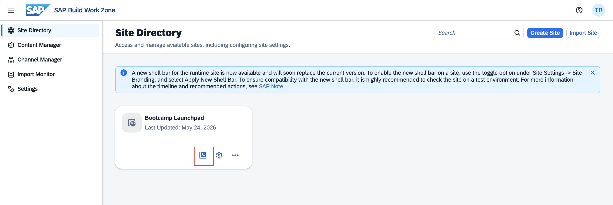</kbd>

2. **Fiori Application** tile now available in Fiori Launchpad.
<kbd> 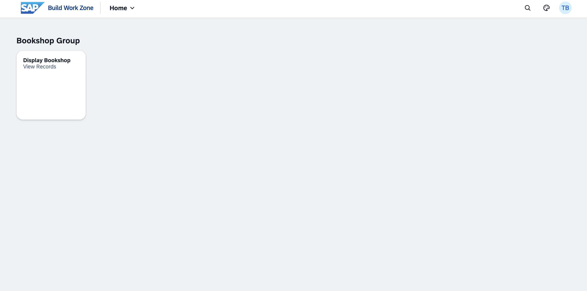</kbd>