# Registration
This is a reference for SAP BTP Registration or Setup of VSCode.

## Registration to BTP
### Steps:

1. Register to SAP BTP Trial Account by clicking the link below. Click `Try Now`. https://www.sap.com/sea/products/technology-platform/trial.html

    <kbd>  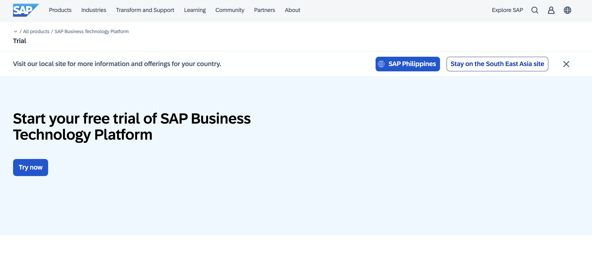 </kbd>

2. Enter your email address:

    <kbd>  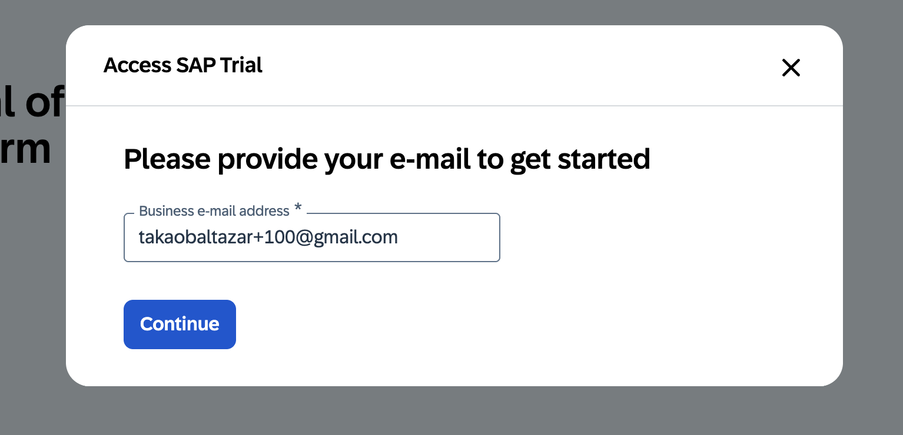 </kbd>

3. Fill-up the following details:

    <kbd>  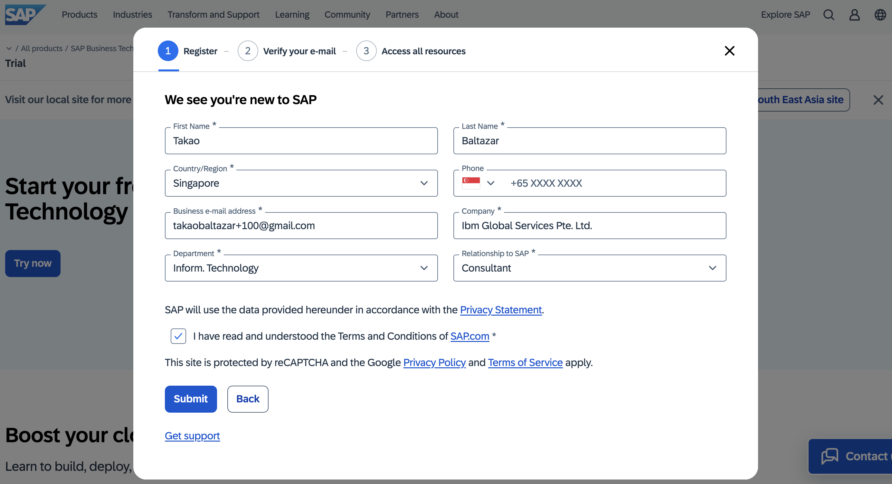 </kbd>

4. Once you submit the registration, an email will be sent to create your password.

    <kbd>  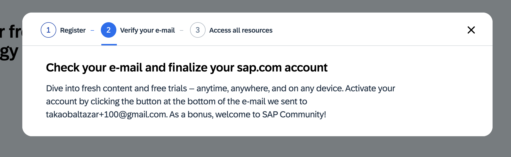 </kbd>

5. Open your email and check the email subject `Activate Your Account for SAP.com`. Click button `Click to activate your account`.

    <kbd>  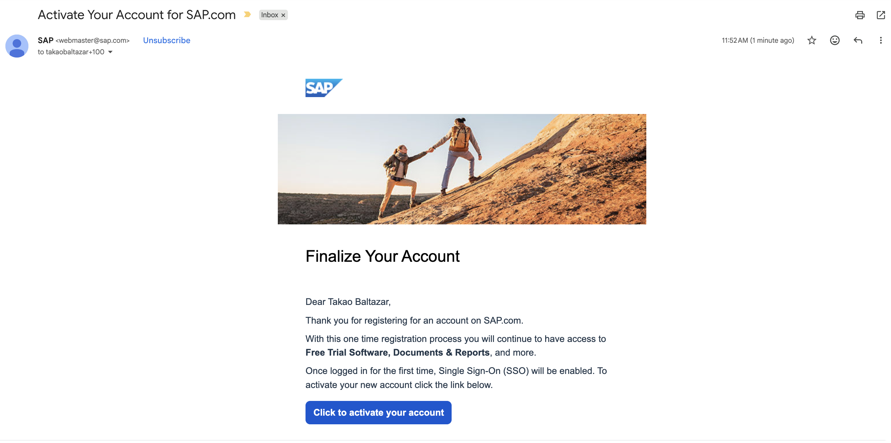 </kbd>

6. Set your password.

    <kbd>  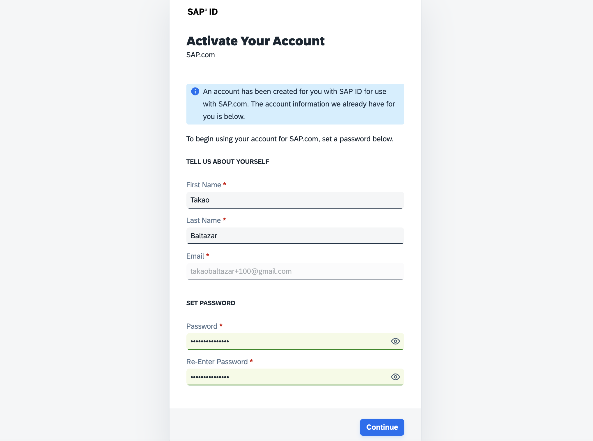 </kbd>    

7. Account activated.

    <kbd>  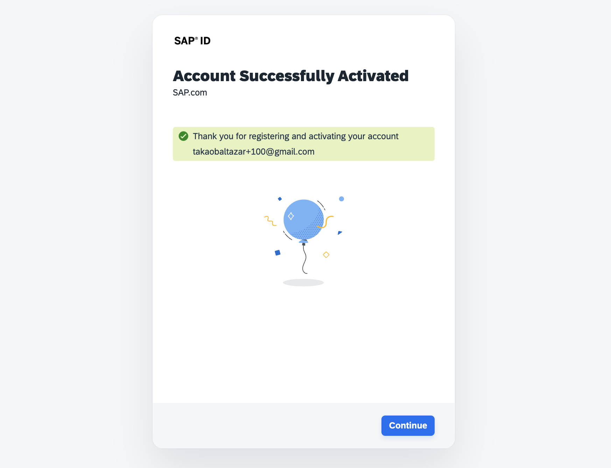 </kbd>

8. Now go to SAP HANA BTP Trial: https://cockpit.hanatrial.ondemand.com/

9. The last step is to verify your mobile number.

10. In case of issue / problem during mobile verification, we need to setup [VSCode](#vscode---in-case-btp-not-available). SAP might have restrict the PH Region for Mobile verification.

    <kbd>  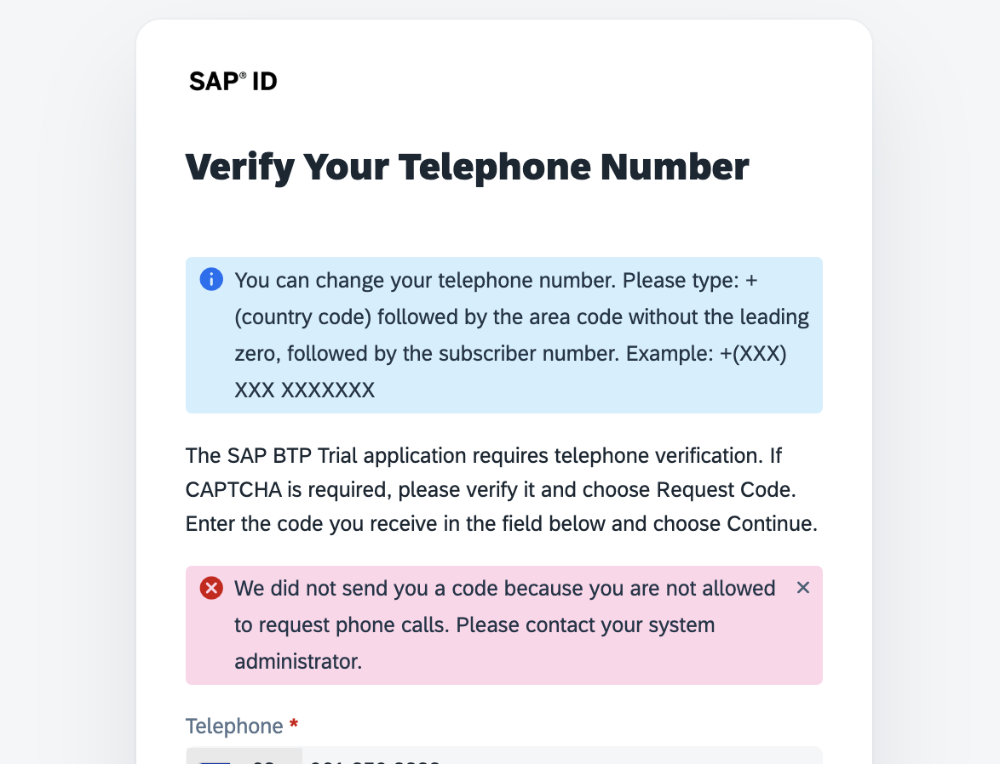 </kbd>

    >   If you have an existing SAP BTP Trial that has been fully verified, you can use it instead.

11. If you are able to verify your mobile number successfully, then you can proceed on the next step.

12. Open the [BTP Trial Cockpit](https://account.hanatrial.ondemand.com/trial/#/home/trial). Then click `Continue to Trial Home`.

    <kbd>  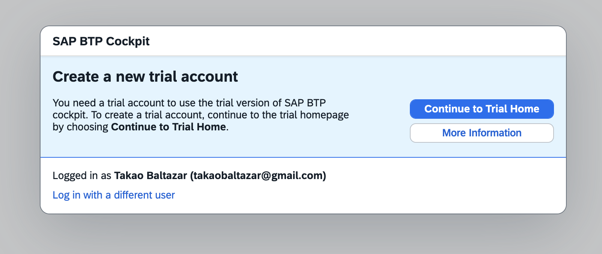 </kbd>

13. Click `US East (VA) - AWS`.

    <kbd>  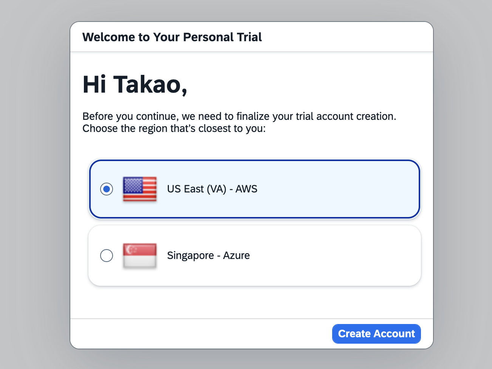 </kbd>

14. After selecting the region, this will create a Global Sub Account.

    <kbd>  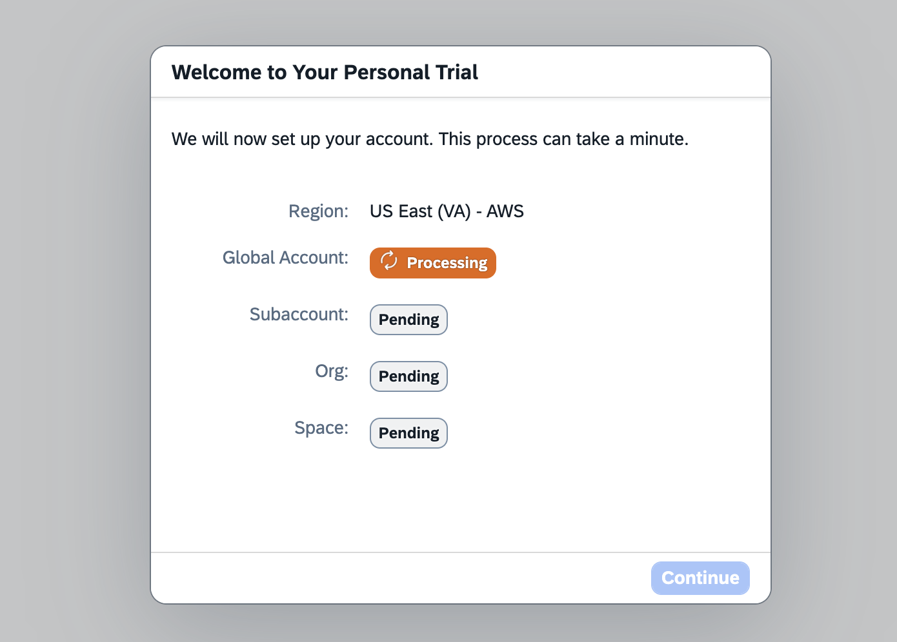 </kbd>

15. Once completed, click `Go to Your Trial Account`.

    <kbd>  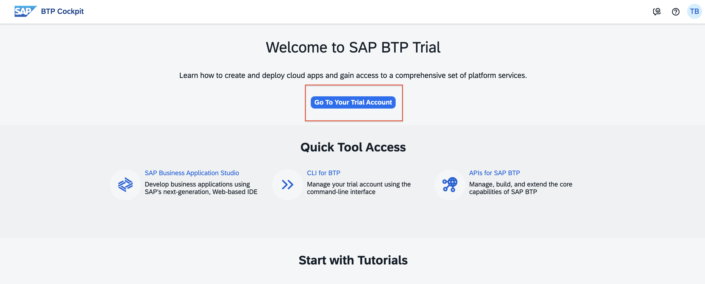 </kbd>

16. SAP BTP Trial Account Completed - With Global Sub Account.

    <kbd>  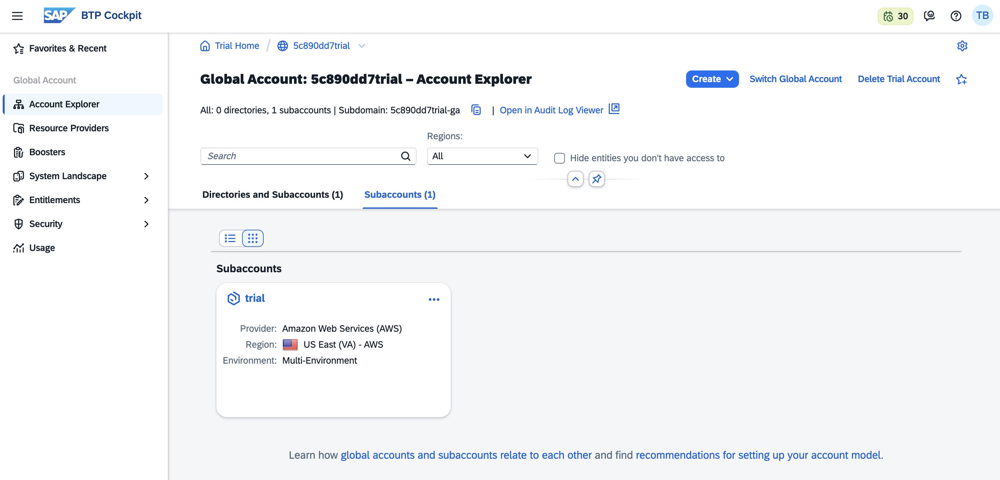 </kbd>

## VSCode - In case BTP not available

This step is only applicable if you are not able to register successfully in SAP BTP and unable to use the Business Application Studio (BAS). Otherwise, you can skip this step.

### Steps
1. Download [VSCode](https://code.visualstudio.com/).
2. Install the necessary `VSCode Extensions`:
    - sapse.vscode-cds
    - sapse.sap-ux-fiori-tools-extension-pack
    - mtxr.sqltools-driver-sqlite
    
    <kbd>  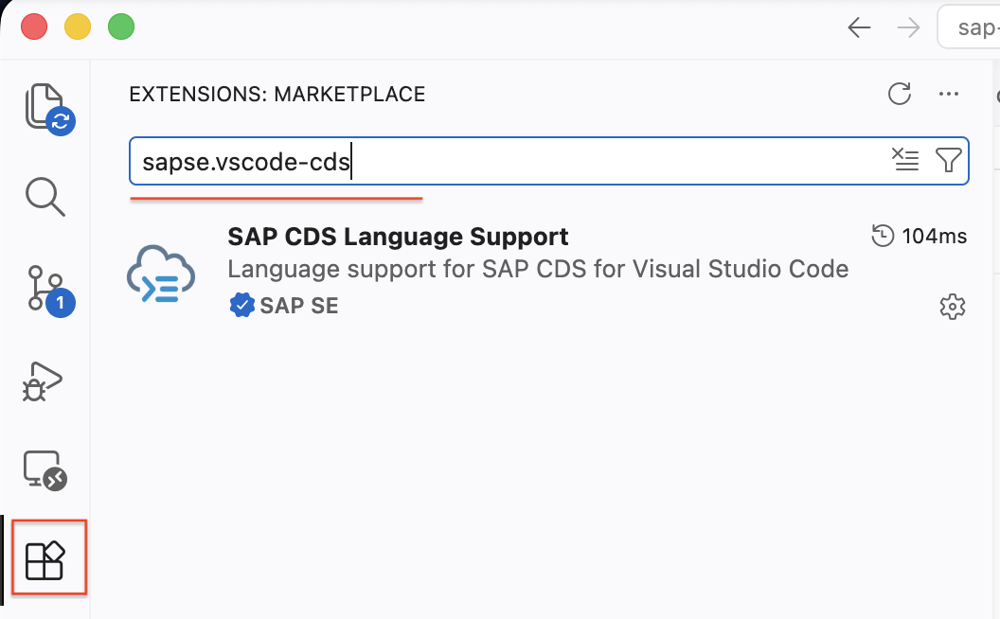 </kbd>

3. Download [Node JS / NPM](https://nodejs.org/en/download). 

4. Install the following NPM Packages via terminal once Node JS / NPM has been installed in your machine.
    - npm i -g @sap/cds-dk
    - npm i -g mta

    <kbd>  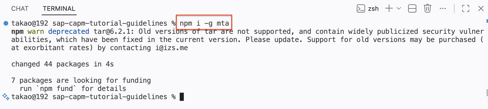 </kbd>

5. After installing all the software and dependencies, let's try to verify it.
6. Press the following and search for `Open application Wizard`.
    - For Windows: `ctrl + shift + p`
    - For Mac: `Command + shift + p`

    <kbd>  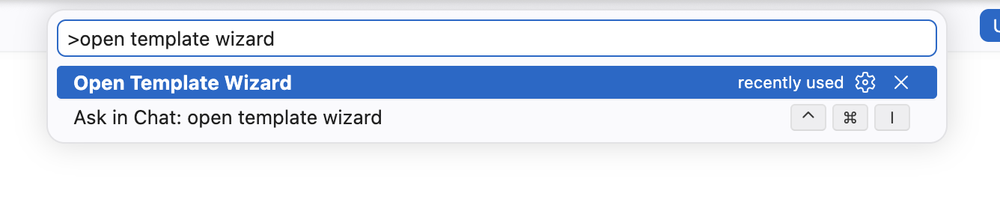 </kbd>

7. A Template Wizard screen will appear, click the `Explore and Install Generators` link.

    <kbd>  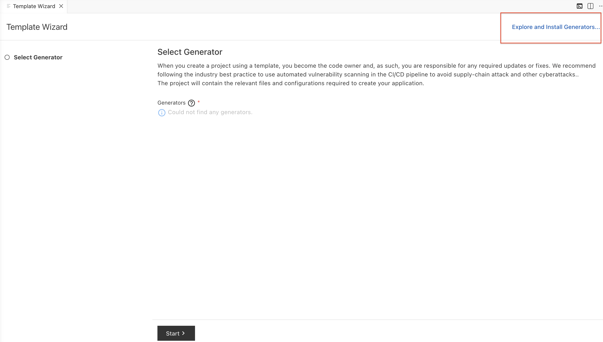 </kbd>

8. Install the following:
    - @sap/generator-cap-project
    - @sap/generator-fiori

    <kbd>  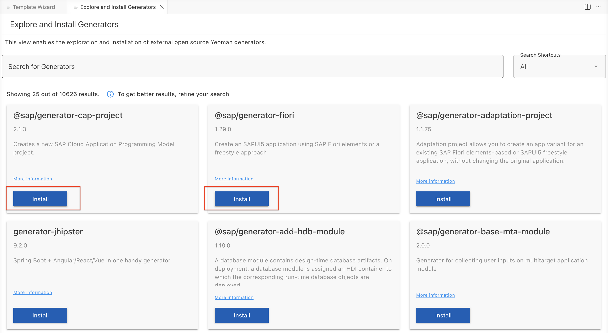 </kbd>

9. Click the item and it should open a window to allow you in creating a project. We will not create a project for now and let's wait for the Official Bootcamp to start.

    <kbd>  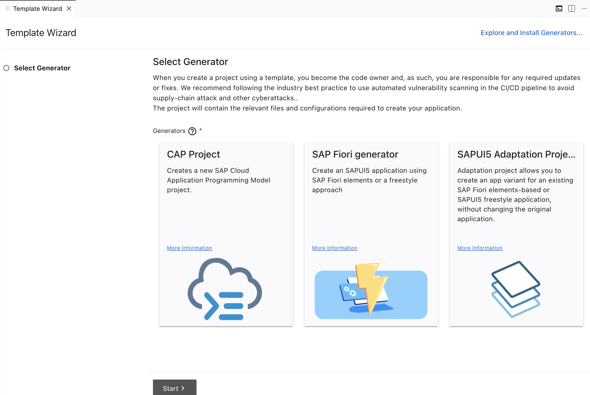 </kbd>