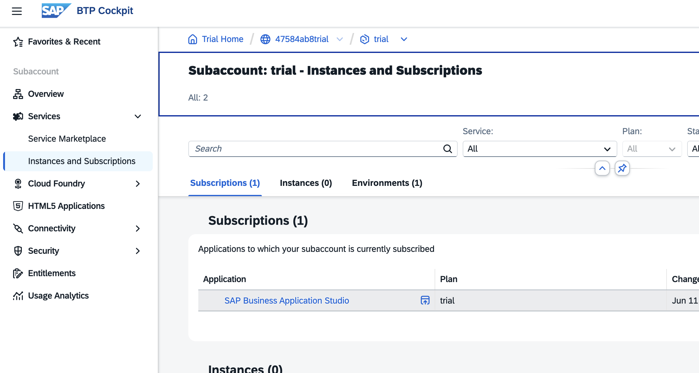
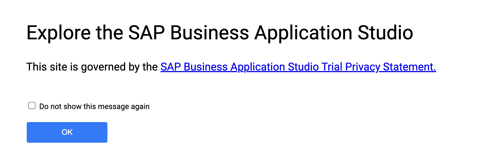
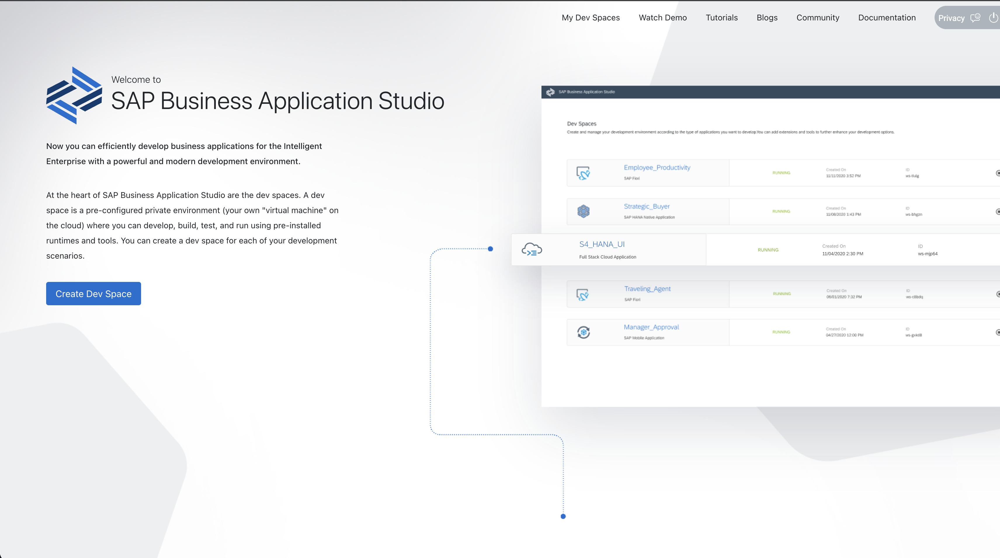
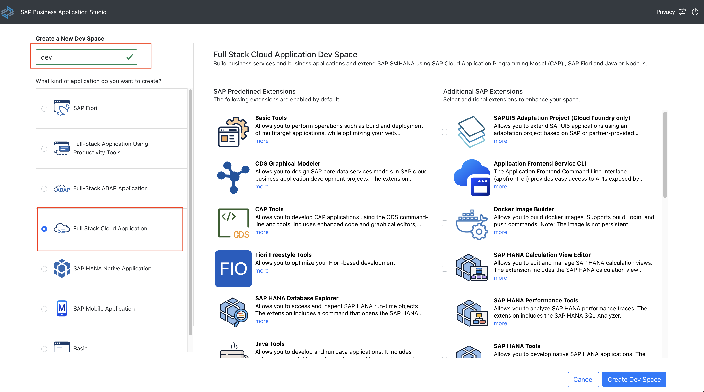
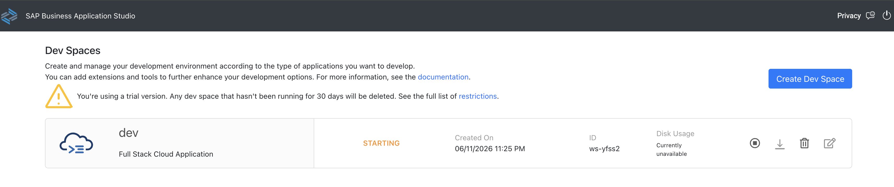
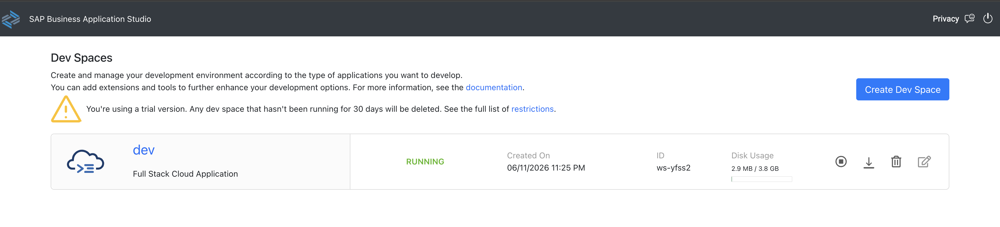

# Registration
This is a reference of Code for Day 1 Exercise.

## Registration to BTP
### Steps:

1. In your BTP Cockpit sub-account, Go to `Services` > `Instances and Subscription` > `Subscription` tab. Then, click the `SAP Business Application Studio`.

    <kbd>   </kbd>

2. Click `OK` 

    <kbd>   </kbd>

3. Click `Create DEV Space`.

    <kbd>   </kbd>

4. Fill-out the following for the creation of work space. Then click `Create Dev Space`.
    - Dev Space Name: `dev`
    - Application Type: `Full Stack Cloud Application`.

    <kbd>   </kbd>

5. Workspace will now be created. Once the status is `Running`, you may now click the `dev` link.

    <kbd>   </kbd>
    <kbd>   </kbd>

## VSCode - In case BTP not available
This step is only applicable if you are not able to register successfully in SAP BTP and unable to use the Business Application Studio (BAS). Otherwise, you can skip this step.

### Steps
1. Download [VSCode](https://code.visualstudio.com/).
2. Install the necessary `VSCode Extensions`:
    - sapse.vscode-cds
    - sapse.sap-ux-fiori-tools-extension-pack
    - mtxr.sqltools-driver-sqlite
    
    <kbd>   </kbd>

3. Download [Node JS / NPM](https://nodejs.org/en/download). 

4. Install the following NPM Packages via terminal once Node JS / NPM has been installed in your machine.
    - npm i -g @sap/cds-dk
    - npm i -g mta

    <kbd>   </kbd>

5. After installing all the software and dependencies, let's try to verify it.
6. Press the following and search for `Open application Wizard`.
    - For Windows: `ctrl + shift + p`
    - For Mac: `Command + shift + p`

    <kbd>   </kbd>

7. A Template Wizard screen will appear, click the `Explore and Install Generators` link.

    <kbd>   </kbd>

8. Install the following:
    - @sap/generator-cap-project
    - @sap/generator-fiori

    <kbd>   </kbd>

9. Click the item and it should open a window to allow you in creating a project. We will not create a project for now and let's wait for the Official Bootcamp to start.

    <kbd>   </kbd>